# Week 2
## Quick Review

Let’s quickly summarize what we covered last week to refresh our memory. We learned about resistors and how they resist the flow of current, capacitors and how they store energy, how LEDs work, and finally RC circuits.

Resistors limit how much current can flow through a circuit, which helps protect components and control how different parts of the circuit behave. Capacitors store electrical energy in an electric field and can release it later, which makes them useful for things like filtering, timing, and smoothing signals. LEDs are light-emitting diodes that produce light when current flows through them in the correct direction. RC circuits combine resistors and capacitors together, and they are often used to create timing effects or delays in signals.

So far, we’ve been working with what are known as **passive components**. They are called passive because they only store, consume, or release energy. In other words, they act on signals that already exist in the circuit rather than creating new ones or amplifying them.

Now we’re going to move on to our first **active component**: the transistor.

## The Humble Transistor

Transistors are basically the backbone of electronics. Every chip you see contains a huge number of tiny transistors inside it. Over time, we’ve managed to make transistors extremely small. Modern commercial chips use processes around **2 nm**, while about 20 years ago the size was closer to **180 nm**, and another 20 years before that it was roughly **3 µm**.


Now let’s understand what a transistor actually is. In simple terms, it’s essentially a **switch** that you can turn on or off by applying a small current. Where might this be useful? Imagine you want to boost an audio signal into something stronger. A transistor can do this by using a small input current to control a much larger current.

There are many different types of transistors, but we’ll start with one of the simplest and most common: the **BJT (Bipolar Junction Transistor)**. A BJT is a three-terminal device with pins called the **base**, **emitter**, and **collector**.

The basic idea is that, by default, the collector and emitter are not connected, similar to an open switch. When a small current is applied to the **base**, the transistor turns on and allows current to flow between the **collector** and **emitter**.

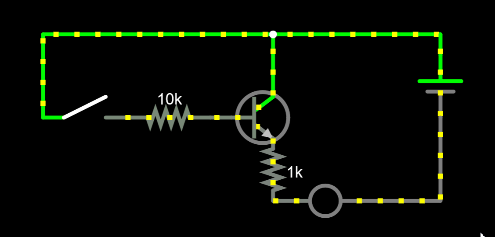


BJT transistors come in two types: **NPN** and **PNP**. The difference between them is how the base needs to be driven. With an **NPN transistor**, you need to apply a **positive voltage to the base relative to the emitter** in order to turn it on. For a **PNP transistor**, it’s the opposite. You need to apply a **negative voltage to the base relative to the emitter** to close the circuit.

Now let’s hop into **Falstad**, create a new project, and play around with transistors to understand how they work. We’ll build a simple circuit that controls an **LED using an NPN transistor**.

To start, place an **NPN transistor** by selecting one from the top bar. Then add a **5 V voltage source** and connect it to the **emitter**.

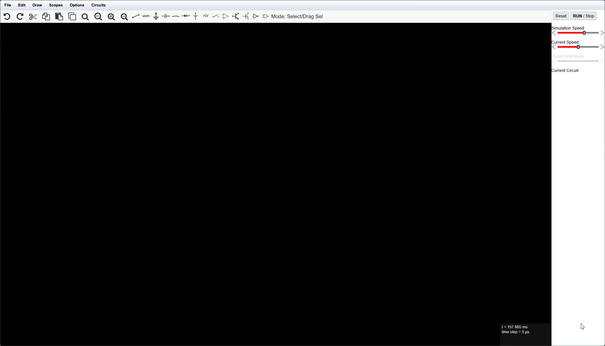

Next, add an LED and connect its positive side to the emitter of the NPN transistor. Connect the other side of the LED to ground using a ground flag with a current limiting resistor, which you can find on the top bar.

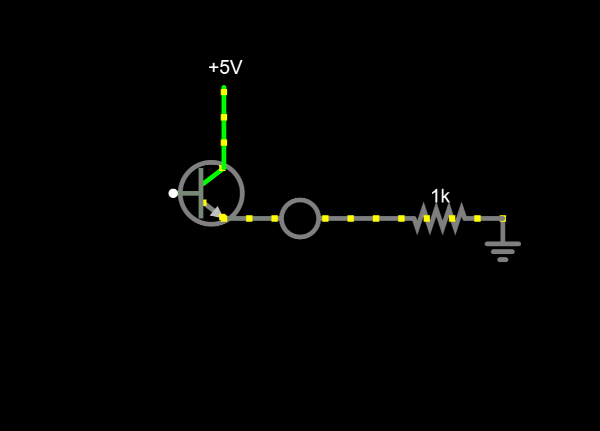

Next, connect the base to 5 V through a current-limiting resistor and a switch, and the circuit is complete.

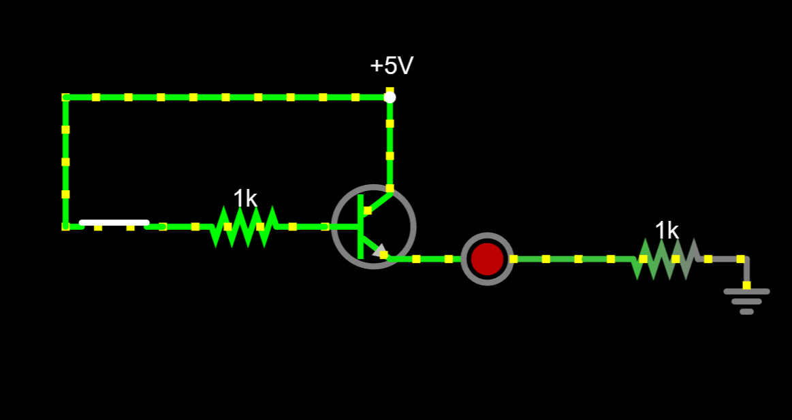

Now open two scopes in Falstad. Place one on the base and the other on the emitter. Close the switch and observe the current on both pins. Notice how we only apply about 2.5 mA to the base, but that results in roughly 25 mA flowing through the emitter.

This happens because a BJT provides current gain. A small current applied to the base controls a much larger current flowing between the collector and emitter. The ratio between these currents is called the current gain (often written as β or hFE). In this example, about 26 uA at the base controlling 2.6 mA through the transistor corresponds to a gain of roughly 10×, showing how a transistor can use a small signal to control a larger one.

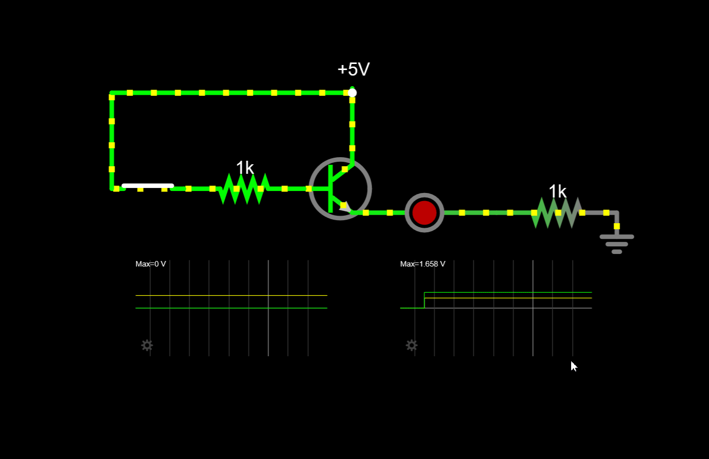

Now that’s just the tip of the iceberg when it comes to what you can do with transistors. One particularly fun circuit we can build with them is called a multivibrator.

### Multivibrators

Multivibrators are circuits that use transistors to create different kinds of switching and timing behavior. They work by repeatedly switching between different states, which allows them to store a state, generate a repeating signal, or produce timed pulses. Because of this, multivibrators are often used in things like timers, oscillators, and simple memory circuits.

There are three main types of multivibrators:

- Bistable Multivibrator (Flip-Flop)
- Astable Multivibrator (Oscillator)
- Monostable Multivibrator (One-shot)
#### Bistable Multivibrator

A bistable multivibrator, often called a flip-flop, has two stable states. This means the circuit can stay in one of two positions indefinitely until something causes it to switch.

For example, one transistor may be on while the other is off, and the circuit will remain in that configuration until a trigger signal flips the state. Once triggered, the roles swap: the transistor that was off turns on, and the one that was on turns off.

Because it can remember its state, bistable multivibrators are commonly used as basic memory elements in digital electronics.

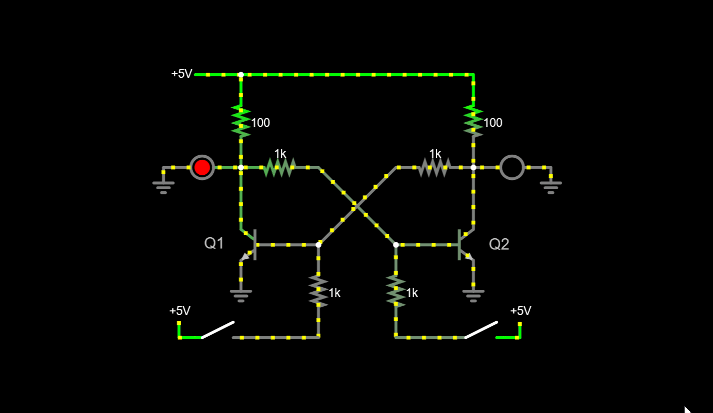

#### Astable Multivibrator

An astable multivibrator has no stable state, meaning it continuously switches back and forth on its own.

In this circuit, the transistors alternately turn each other on and off, creating a repeating cycle. This produces a square wave signal, where the output constantly toggles between high and low.

Astable multivibrators are commonly used as oscillators for things like blinking LEDs, clock signals, and tone generators.

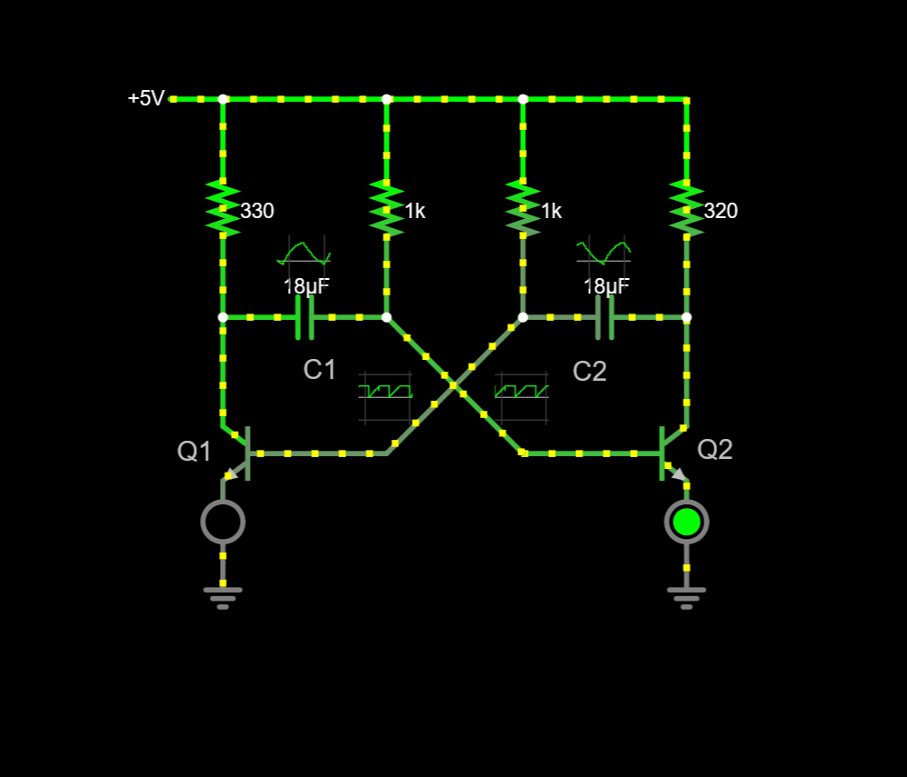

#### Monostable Multivibrator

A monostable multivibrator, also known as a one-shot, has one stable state and one temporary state.

Normally, the circuit sits in its stable state. When it receives a trigger signal, it switches to the temporary state for a short period of time before automatically returning to the stable state.

This makes monostable circuits useful for generating timed pulses, such as creating a fixed delay after pressing a button or ensuring a signal lasts for a specific duration.

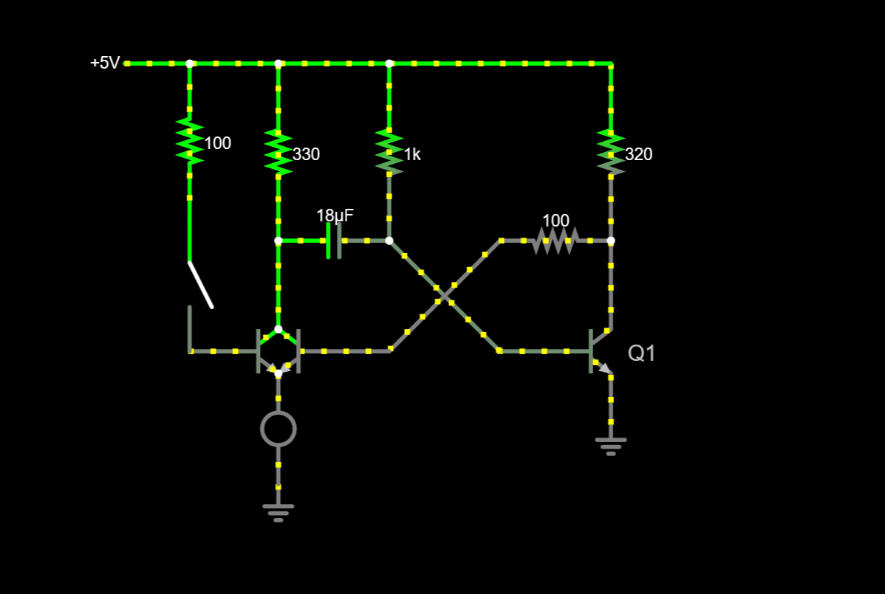


## Make Something Cool!?

Now that you have a solid understanding of transistors, their cool applications, and multivibrators, it’s time to put that knowledge to work. Go ahead and create something fun in Falstad, and once you’re happy with it, we’ll take the next step: designing a real PCB and ordering it.

Here are some ideas to get you started:

- **Basic Dual LED Flasher** – using an **astable multivibrator**
- **LED Sequencer** – using a **ring oscillator**
- **LED Breathing Effect** – smooth fading in and out

*If you want more inspiration, just search for TTL circuits online. There’s a ton of projects you can experiment with!*


I’m going to make a Dual LED Flasher using an astable multivibrator circuit. You can follow along, but make sure to put your own spin on it and make significant changes in your project.

To start, create an astable multivibrator circuit in Falstad. Then, connect two LEDs to the emitters of the transistors. Run the simulation to confirm that the LEDs are flashing alternately as expected.

The timing of the flashes is determined by the RC values in your circuit, the resistors and capacitors connected to the transistors. Larger resistor or capacitor values will slow down the flashing, while smaller values will make the LEDs flash faster. You can experiment with different combinations to get the effect you like.

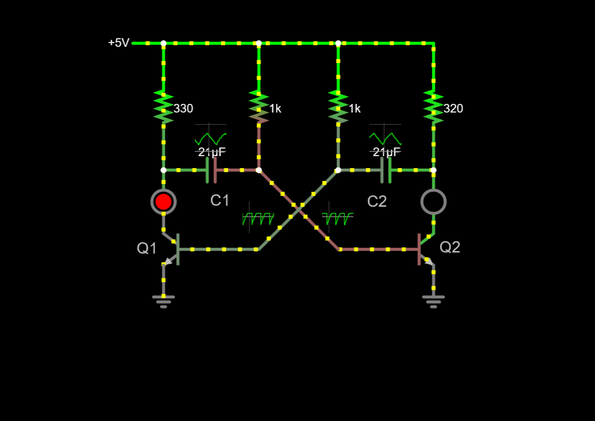

Once your simulation shows the circuit working correctly, we can move on to the next step: designing a PCB to make your flasher a real, physical project!

## PCB Time!

Now that we have our circuit working, we can move on to designing a PCB for it. A PCB, or Printed Circuit Board, is a professional and permanent way to build circuits compared to using a breadboard. Unlike breadboards, which rely on temporary connections with wires and clips, a PCB has copper traces etched onto a board that connect your components exactly where they need to be.

[img]

PCBs make your project more reliable, reduce wiring mistakes, and allow for a compact, organized layout. They also make it easier to reproduce your design multiple times, which is especially useful if you want to share your project or create several units. On a PCB, you can also include labels, mounting holes, and pads for easy assembly, making your circuit neat and professional.

Once we finish the design, we can export the files and send them to a PCB manufacturer to get a real, working version of our Dual LED Flasher.

### Getting Started

To design our PCB, we’ll be using KiCad, an open-source EDA tool that lets us draw schematics and design PCBs. To get started, download KiCad from [kicad.org/download](https://www.kicad.org/download/), install it, and then launch the program.

Once KiCad is open, create a new project by going to **File → New Project**, give it an appropriate name, and save it in your desired location. This will set up the workspace for both your schematic and PCB layout.

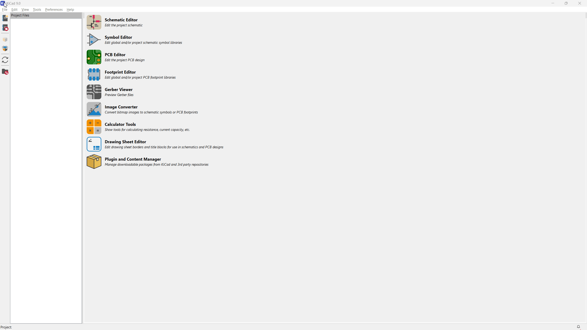

Before we move on, install a plugin called **Fabrication Toolkit**, which we’ll use later in the project.

To install it, open the **Plugin and Content Manager** in KiCad. In the search bar, look for **Fabrication Toolkit**, then click **Install**. After that, click **Apply Pending Changes** to complete the installation.

Once that’s done, you can continue with the rest of the tutorial.

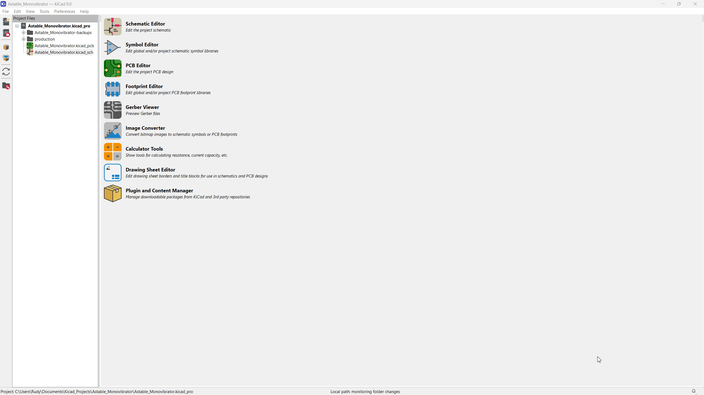


### Schematic Editor

To start, open the schematic editor by double-clicking the `.kicad_sch` file.

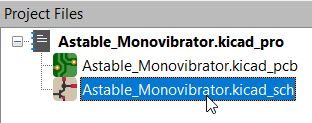

You’ll notice the editor looks like a blank sheet in the middle. This is where we’ll place all of our components for the project. Think of the schematic editor as a blueprint for your PCB. At this stage, you’re only showing what connects to what. Later, in the PCB editor, you’ll decide where everything actually goes on the board.

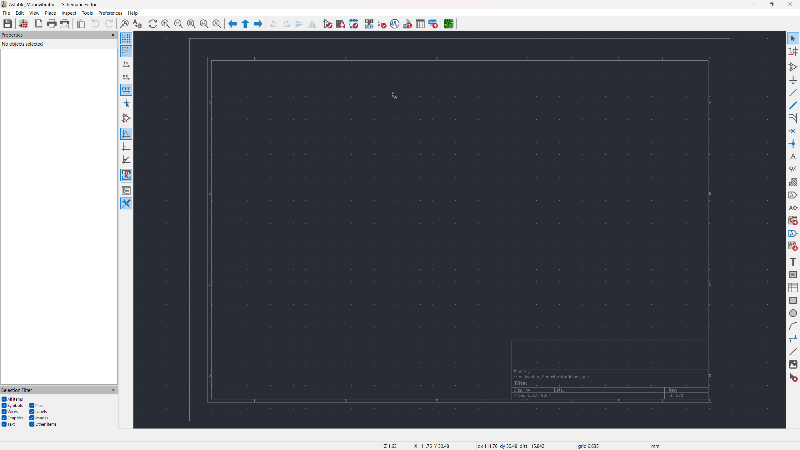

In the schematic editor, we’ll redraw the circuit we built in Falstad. In KiCad, the components you place on the sheet are called symbols. To place a symbol, press `A` to open the symbol browser, search for the component you need, and click OK to place it.

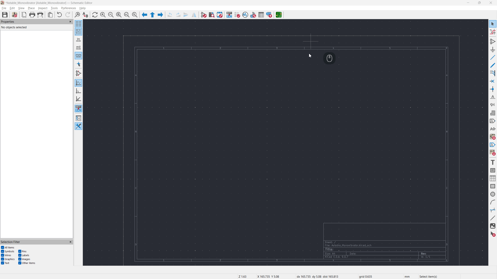

Symbol names in KiCad can be a little confusing. You can either refer to the table below for some common symbols or just search online for guidance.

| **Component**  | **KiCad Symbol Name** |
| -------------- | --------------------- |
| Resistor       | R                     |
| Capacitor      | C                     |
| LED            | LED                   |
| NPN Transistor | Q_NPN_BCE             |
| PNP Transistor | Q_PNP_BCE             |
| Switch         | SW_PUSH               |

I’ll start placing my components on the sheet (excluding the power source) in a neat and organized way. To rotate a symbol, select it and press `R`. You can also flip it horizontally or vertically by pressing `X` or `Y`.

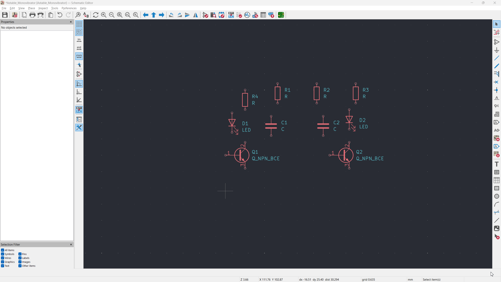

I’ll make sure everything is aligned neatly and looks clean, and then I’ll wire the components together using the **draw wire tool** by pressing `W`.

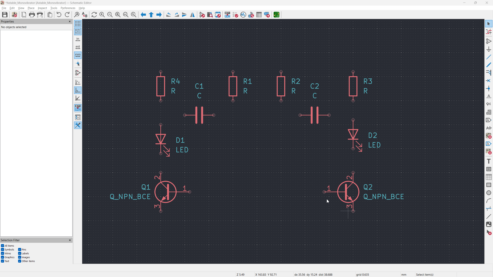

By default, KiCad routes wires at 90 degrees. If you want to route them at 45 degrees or freely, press **Shift + Space** while wiring to toggle the mode. Keep in mind that 90-degree wiring is the standard and preferred method, while 45-degree or free-angle wiring should only be used when it makes sense for clarity.

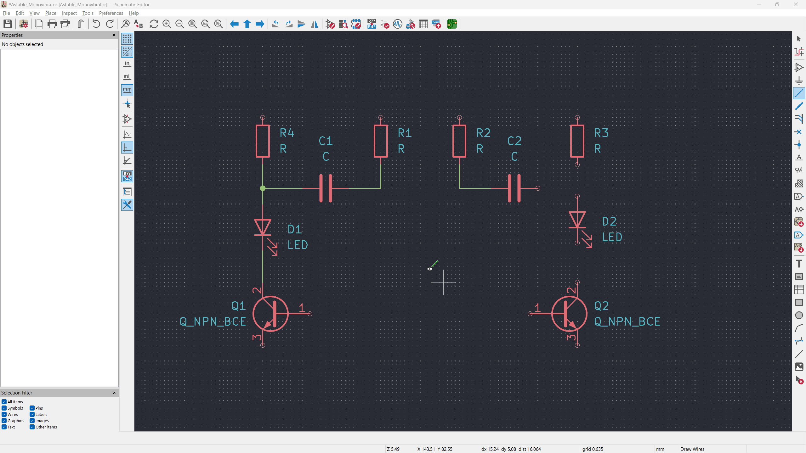

While placing components, you’ll notice that resistors and capacitors don’t have values by default. Double-click a component to open its properties tab and set its value. In schematics, it’s common not to include the unit since it’s usually obvious. For example, a 1K ohm resistor can just be entered as `1K`, and a 22uF capacitor can be written as `22u`.

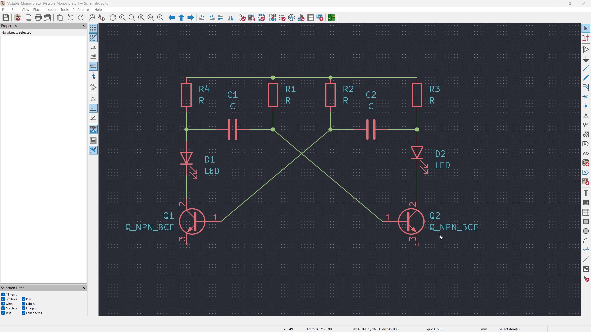


Once you add the values for all the components, we’ll add power to the schematic. Place a **VCC** flag for the positive rail and a **ground** flag for the reference. Open the symbol browser and search for **VCC** and **ground** to find them.

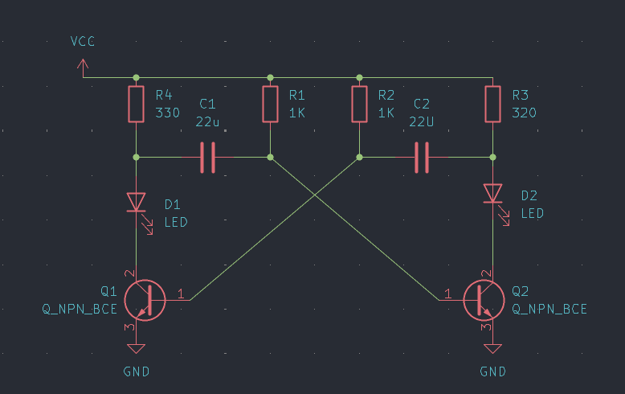

We also need a way to physically connect our power. For this, place a **Conn_01x02** symbol and connect one pin to VCC and the other to ground. As a general rule in schematics, the **power flag should point up** and the **ground flag should point down**, so keep that in mind while placing them.

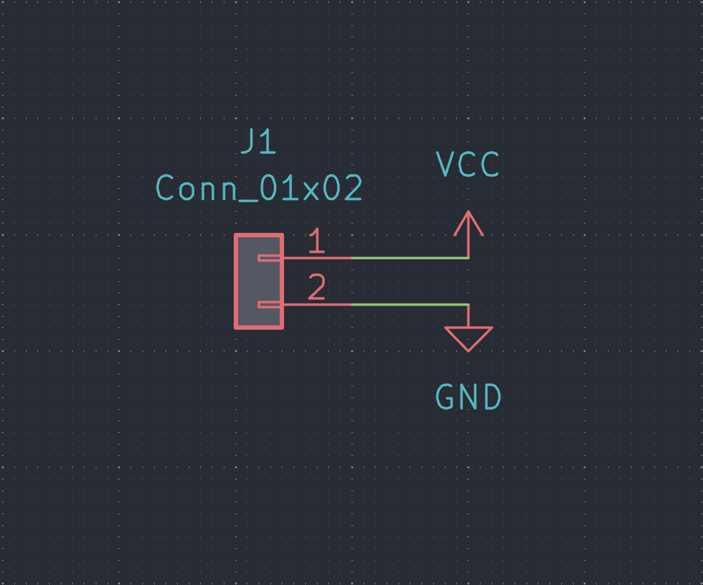

Once your schematic is finished, you’re almost ready to move to the PCB editor. Before that, we need to **assign footprints** to all the components. A footprint defines how a component will actually appear physically on the PCB. For example, in the schematic you can represent a resistor as a simple box, but in the PCB editor you need a footprint because resistors come in many different shapes and sizes.

To assign footprints, click on the **Assign Footprints** icon in the top bar.

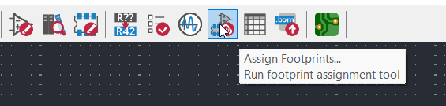

In the Assign Footprint dialog, select a symbol, use the search bar to find the appropriate footprint, and then **double-click** the footprint to assign it to that symbol.

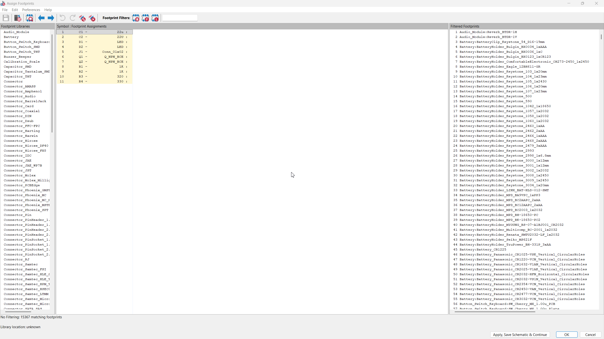

Here’s a table showing the footprints you should use for each symbol.

| **Symbol** | **Footprint**                                                 |
| ---------- | ------------------------------------------------------------- |
| Transistor | Package_TO_SOT_THT:TO-92L_Inline_Wide                         |
| Resistor   | Resistor_THT:R_Axial_DIN0204_L3.6mm_D1.6mm_P7.62mm_Horizontal |
| Capacitor  | Capacitor_THT:C_Disc_D5.0mm_W2.5mm_P5.00mm                    |
| Switch     | Button_Switch_THT:SW_PUSH_6mm                                 |
| Header     | Connector_PinHeader_2.54mm:PinHeader_1x02_P2.54mm_Vertical    |
| LED        | LED_THT:LED_D5.0mm                                            |

Once you’re done assigning footprints, click **Apply** or **OK**. While you’re here, also make sure to **save your schematic** by pressing `Ctrl + S`.

### PCB Editor

Now that our schematic is complete, we can move on to the **PCB editor**. To do this, click the **Switch to PCB Editor** button in the top toolbar.

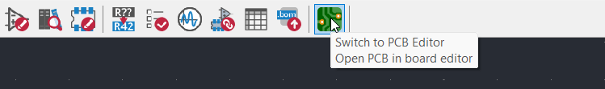

This will open the PCB editor. Once you’re there, click the **Update PCB from Schematic** button on the top bar, or simply press `F8`. In the dialog that appears, click **Update PCB**. This will import all the component footprints from the schematic, and you can then click to place them on the board.

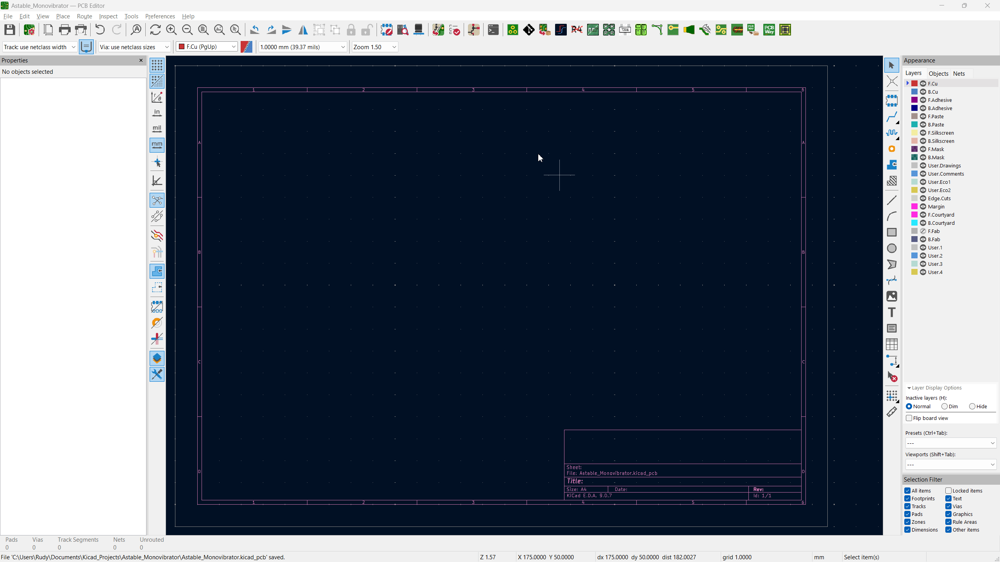

Now let’s quickly go over some basics of the PCB editor. On the top bar, you’ll see several drop down menus that show things like the **layer you are working on** and the **grid size** used for snapping. You can change these using the drop down menus. I recommend keeping the grid at **1.0 mm** by default.

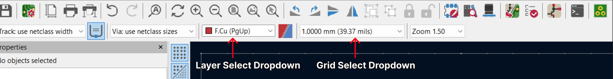

On the right sidebar you’ll find a lot of tools for things like **routing tracks, drawing shapes, and placing objects**. Even further to the right is the **appearance panel**, which shows all the PCB layers.

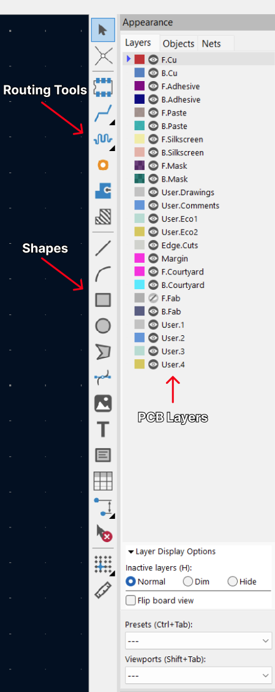

You’ll notice that a PCB has many different layers, which might seem overwhelming at first. In reality, it’s not that complicated, and for this project we only need to care about a few key ones:

**F.Cu**  
This is the front copper layer of the PCB. Copper traces placed on this layer form electrical connections between components on the top side of the board.

**B.Cu**  
This is the back copper layer. Just like the front copper layer, it is used to route electrical connections, but on the bottom side of the board.

**F.Silkscreen**  
This is the front silkscreen layer. It’s used for printed markings on the PCB such as component labels, outlines, logos, or other helpful text.

**B.Silkscreen**  
This is the silkscreen on the back of the PCB. It works the same way as the front silkscreen but appears on the underside of the board.

**Edge.Cuts**  
This layer defines the physical outline of the PCB. Any lines drawn on this layer tell the manufacturer where the board should be cut.


By default, the PCB editor displays all layers, which can make things look a bit cluttered. Sometimes we only want to see the important layers. Before getting started, go to the appearance panel on the right sidebar where the layers are listed and click the **eye icon** for the **F.Fab** and **B.Fab** layers. This hides them and makes the board easier to see while working.

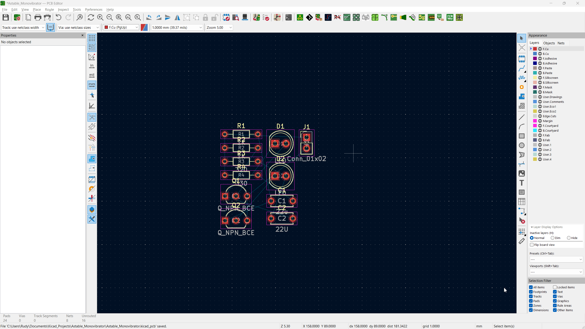


#### Board Outline

When designing a PCB, it’s usually best to start by defining the **shape of the board**, and then move on to placing and routing the components. So take a few minutes to think about how you want your PCB to look. You could go with a simple rectangle, but where’s the fun in that?

I’m going to make mine in the shape of a **low poly cat**. To do that, I’ll first draw the outline in a different app like **Figma** or something similar, just because it’s easier for me to sketch the shape there. Or I'll find and image off google and then paste it. Then I’ll copy the image and paste it into the PCB editor.

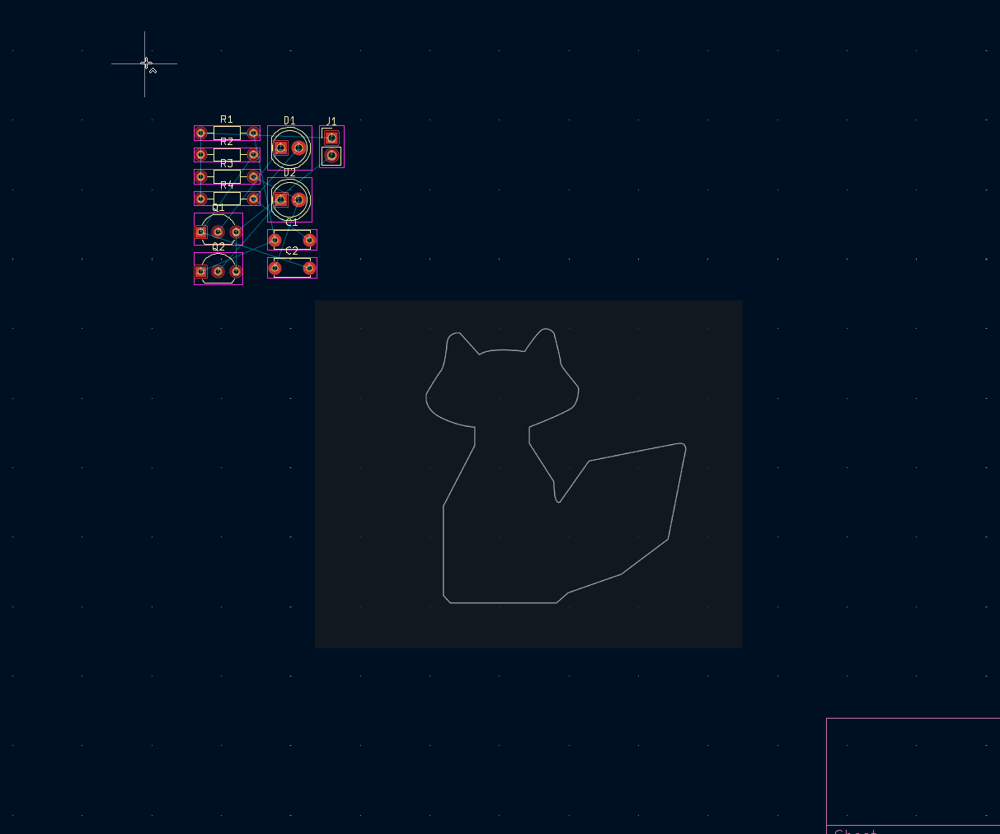

Before you start drawing the outline, there’s one important constraint. Our PCB needs to stay **under 100 × 100 mm (10 × 10 cm)**.

To make this easier, go to the **User.Drawing** layer, select the **rectangle tool**, and draw a **100 × 100 mm square**. This will act as a reference for the maximum board size. Make sure everything you design stays inside this box.

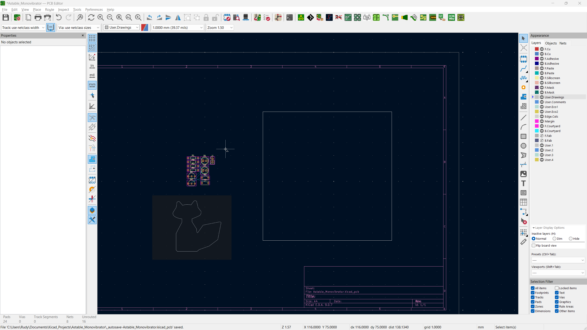

Next, I’ll resize my cat image so it fits nicely inside the square. After that, I’ll switch to the **Edge.Cuts** layer, select the **draw lines tool**, and start tracing the outline of the cat. If you want smoother control while drawing, you can reduce the **grid size** and make it smaller.

The grid controls how objects snap while you place them. With a large grid, your lines will jump in bigger steps, which can make detailed shapes harder to draw. By switching to a smaller grid size, you can place points more precisely and follow curves or angles more closely. This is especially helpful when outlining more detailed or organic shapes like the cat design.

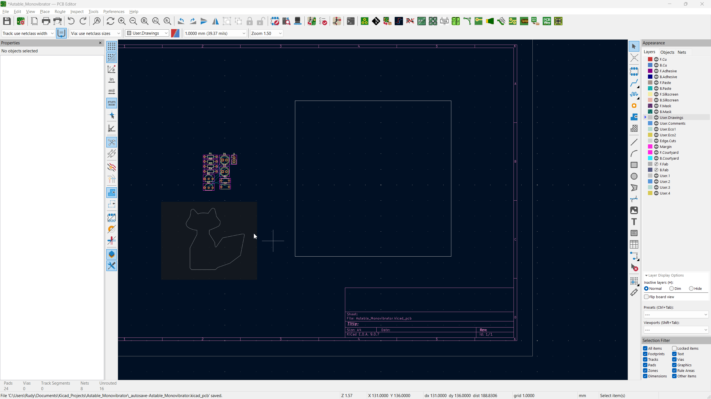
*Resizing Cat*

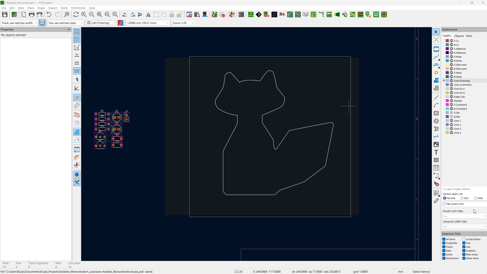

Once you finish outlining and your shape is completely closed, you can select the image you traced over and delete it. You can also open the **3D viewer** from the top bar to see how your PCB shape looks.

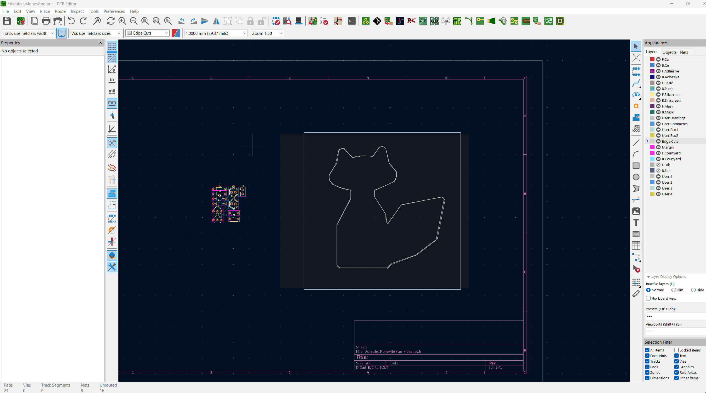

You can also go ahead and delete the 100x100mm box you drew on the User.Drawings layer.
#### Component Placement

After completing your board outline, the most crucial step is **component placement**. Many people skip paying attention to this, but poor placement can make routing extremely difficult. In fact, PCB design is often about **80% creating an optimized layout** and only **20% actual routing**, so it’s worth spending some quality time here.

To start, place the **major components** first. In my design, the LEDs are the main focus because I want them to sit in the cat’s eyes. The next major component is the **battery header**, which I’ll place on the tail. Starting with the key components helps define the rest of the layout and makes routing the smaller components much easier.

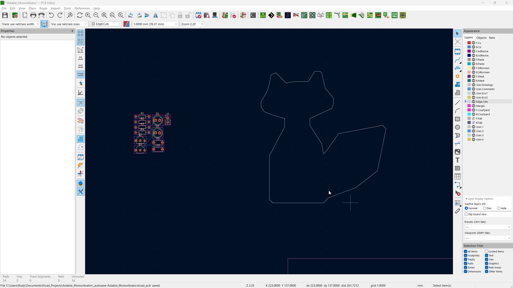

From this point on, it’s helpful to keep the schematic and PCB editor side by side. Try to place components that are connected or work together physically close on the PCB. For example, a resistor connected to a transistor should sit right next to that transistor. Think of it as grouping components into functional blocks. Here’s a pro tip: in the schematic editor, select the components you want to focus on. They will be highlighted on the PCB editor, making it much easier to see where each component should go.

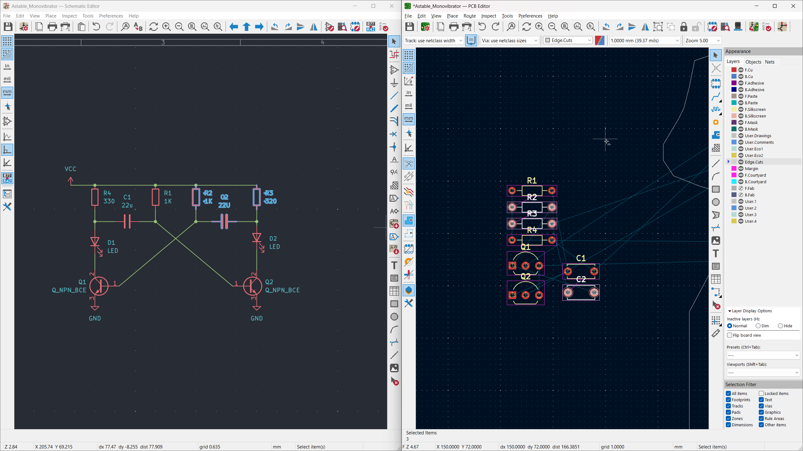


This is the layout I ended up with that felt most optimized to me and had the shortest rat lines (the blue lines you see), which will make routing easier and cleaner.

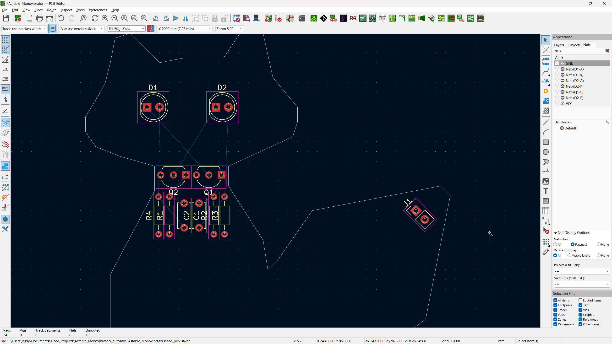


Now that the layout is in place, you can start routing and connecting traces, but before we do that, it’s a good idea to **fix up the silkscreen designators** on the board. These are the labels like R3, C1, and so on. Right now, they might be messy or overlapping with other silkscreen markings.

These designators tell you **which component corresponds to which symbol on the schematic**, making it much easier to assemble and debug the board. Clear, organized designators prevent mistakes when soldering and help anyone else reading the board understand the circuit.

I’ll go ahead and select each designator, then move and arrange them so they’re neatly positioned and clearly visible.

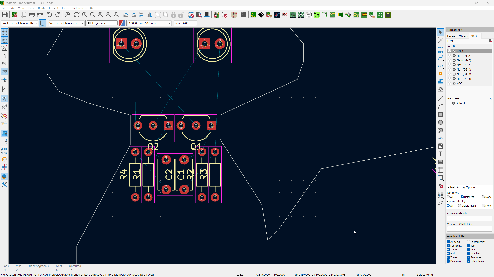


#### Routing

Now it’s time to start wiring everything up. First, make sure you are on either the `F.Cu` or `B.Cu` layer, which are the copper layers where traces are drawn. Once you’re on the correct layer, press `X` to start routing.

Click on a pad, and a trace will automatically start following your cursor. Move it to the pad you want to connect and click to complete the connection. Repeat this process for all the highlighted pads.

A pro tip is to leave the VCC and GND connections for last and focus on routing the signal traces first, as these are usually the most critical for your circuit’s functionality.

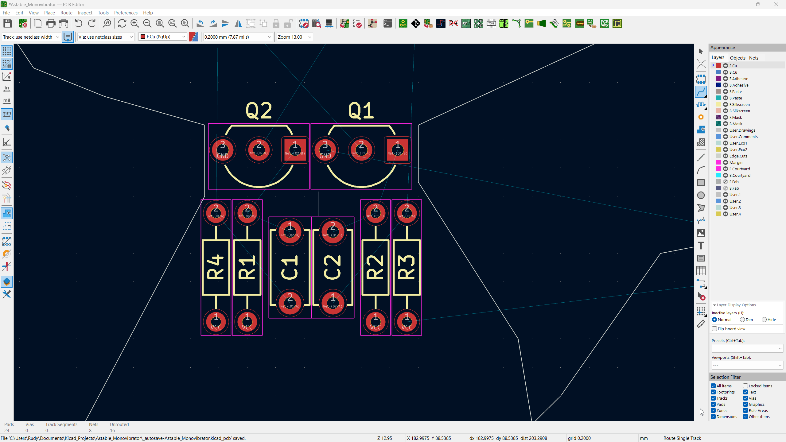


For traces that are difficult to route or would require long, awkward paths, we can use a special trick. Switch your working layer to **B.Cu** to route on the other side of the board, which often makes routing much easier.

To do this, make sure nothing is selected and press `V`, or you can select the back copper layer directly from the layers tab. This lets you move traces to the bottom layer and avoid messy or overly long connections.


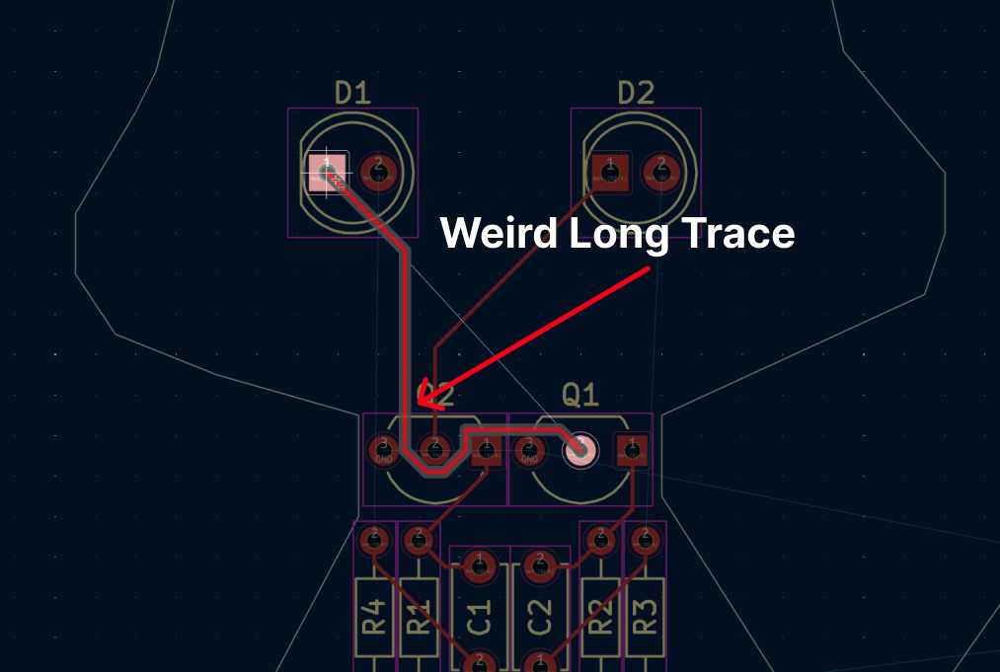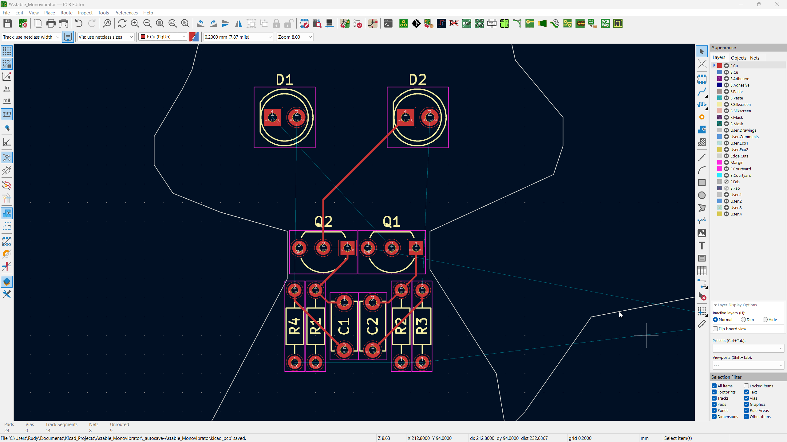

Once all your signal traces are routed, I suggest switching to the **B.Cu** layer to route your ground and VCC connections. While doing this, I noticed that my routing for the power header wasn’t optimal, so I simply rotated the header 180 degrees to make the connections easier.

Keep in mind that hardware and PCB design is an **iterative process**. You rarely get a perfect board on the first try. You’ll often need to move components, rotate them, or even start sections over. Making adjustments is a normal and important part of the design process.

This is what my fully routed board looks like.

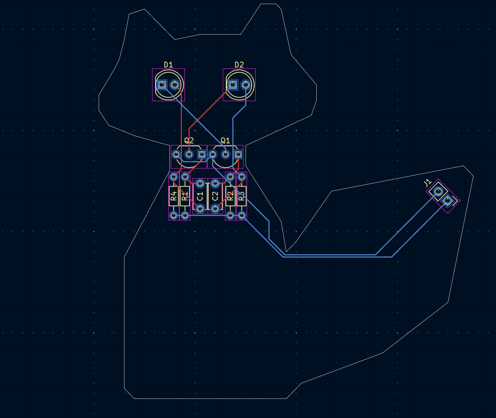


At this point, your PCB is basically done. The last thing to focus on is adding some silkscreen art to give your board personality and make it look polished :D

#### Silkscreen

Silkscreen is basically anything that will be printed on your PCB. On the silkscreen layer, we commonly add things like **component designators, labels, logos, decorative text, or simple shapes**.

You can place silkscreen on both the front and back of the board. To add it, select either the **front or back silkscreen layer** and then start drawing using the shape tools or add text.

I’ll hop onto the **front silkscreen layer**, use the line tool to draw around the edges for a cool outline, and add some whiskers on the cat to give it personality!

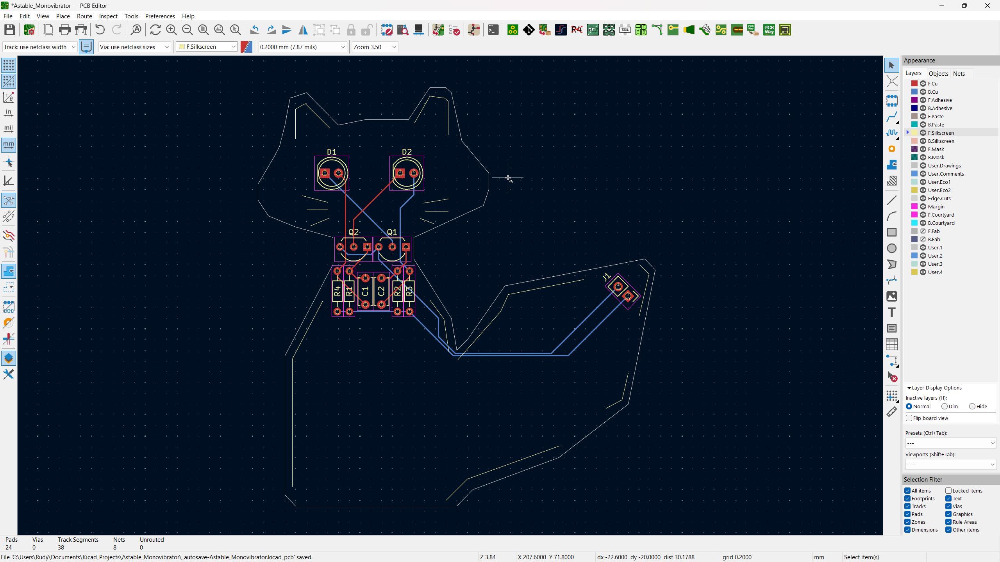
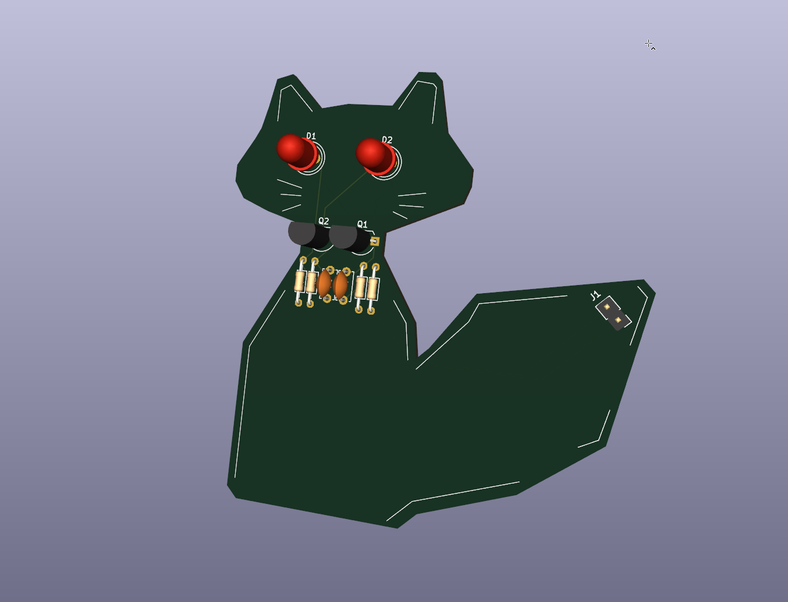

While I’m on the silkscreen layer, I’ll also add symbols to indicate which pin of the header is **ground** and which is **VCC**. This makes it much easier to connect the power correctly when assembling the board.

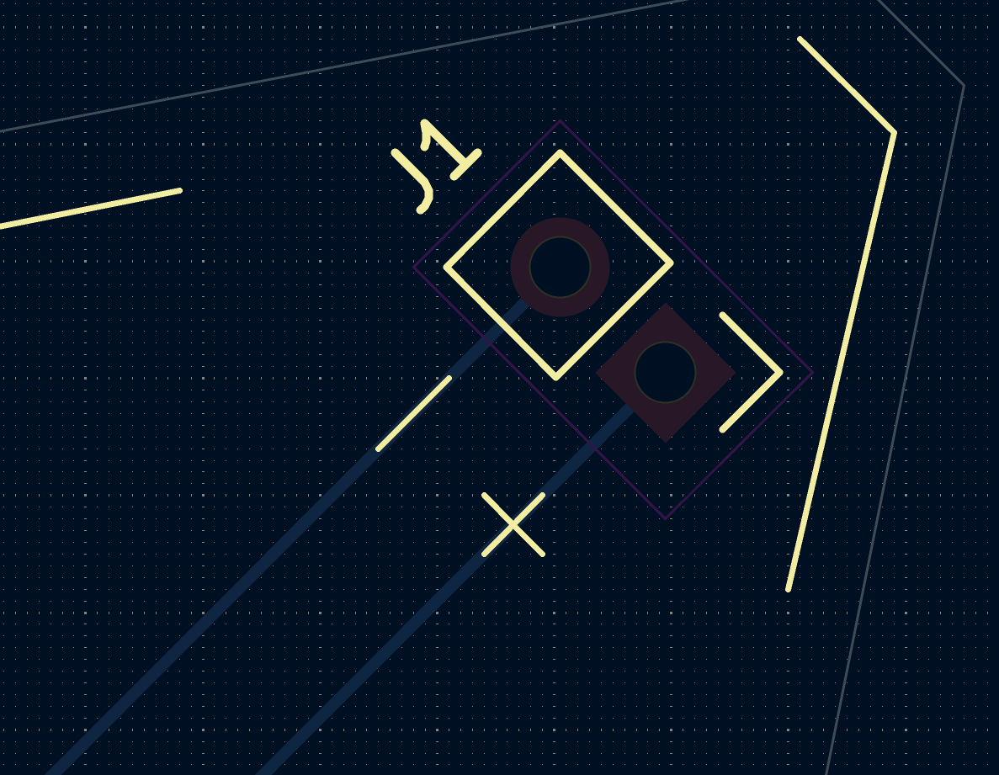

I’ll also add some text on the back, like my GitHub handle. To do this, select the **back silkscreen layer**, then use the **text tool** and type out your text. You’ll notice it appears flipped because it’s on the other side of the board. If you want it to look normal while editing, you can flip the board to work on that side and then flip it back when you return to the front.

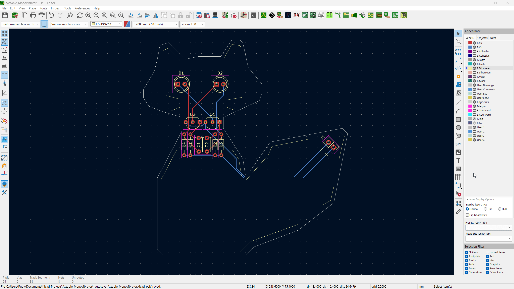

You can get even fancier with silkscreen by importing graphics and custom designs. If you’re interested, just search online to see tutorials on how to do it and get some inspiration.

#### DRC

Before exporting your PCB, there’s an important step you should always follow: running **DRC**, which stands for **Design Rule Checker**. DRC checks your board against a set of rules to make sure there are no errors, such as traces that are too close together, unconnected pads, or components that overlap. Running DRC helps catch mistakes that could cause your board to fail when manufactured.

To run DRC, click the **Design Rule Checker** icon on the top bar. In the dialog that opens, simply click **Run DRC** and review any errors or warnings it shows.

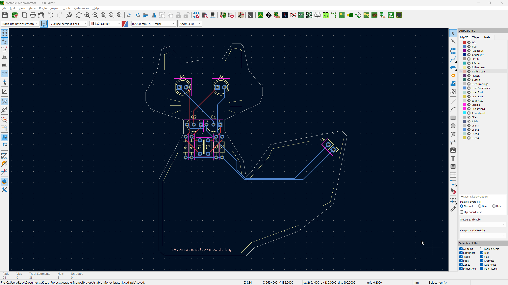

DRC runs and detects any errors in your design, showing a brief description of each issue along with its location. In my design, there are **0 errors** but **6 warnings**. In this case, the warnings don’t affect the functionality, so I can safely ignore them. With that done, I can now go ahead and **export the PCB**.


### Exporting Your PCB

To export the PCB, we’ll use the **KiCad Fabrication Toolkit**. Click on the **Fabrication Toolkit** icon in the top bar. You can leave the default settings as they are. Just make sure to rename the archive to something readable, like `{projectname}_revision{X}`, so it’s easy to identify later.

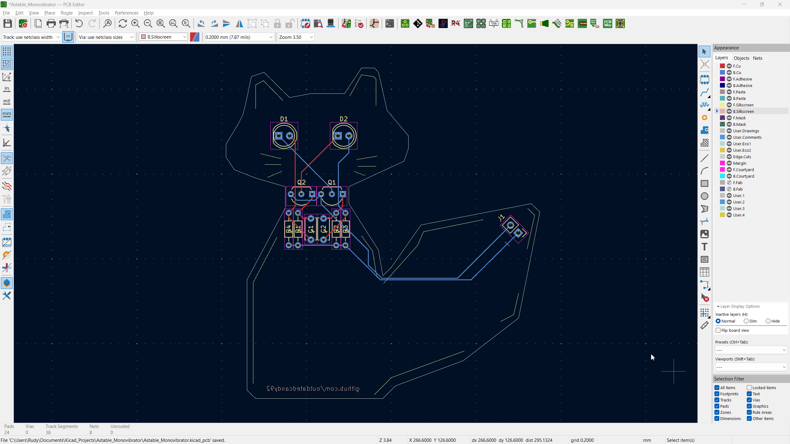

And just like that, you’re done! Your PCB design is complete and ready to be sent off for fabrication.


## Submitting

Now that everything is done, you can get ready to submit your project. Make sure your GitHub repository includes the following:

- A detailed `README.md`
- A `Journal.md` (if you are journaling your progress)
- Falstad source files
- KiCad source files (`.sch`, `.pcb`, `.prj`)
- Production files (Gerbers)

You also need to ensure that your repository is formatted nicely. An example structure could look like this:

```
project-root/
├─ attachments/
│  ├─ image1.png
│  ├─ image2.png
│  └─ image3.png
├─ production/
│  ├─ gerber.zip
│  ├─ bom.csv
│  ├─ designator.csv
│  ├─ position.csv
│  └─ netlist.ipc
├─ src/
│  ├─ kicad/
│  │  ├─ kicad.sch
│  │  ├─ kicad.pcb
│  │  └─ kicad.prj
│  └─ falstad/
│     └─ falstad.txt
├─ Journal.md
└─ README.md
```

In your `README.md`, make sure you include the following:

1. A title
2. What the project is and why you made it
3. A PCB render
4. A Falstad simulation and explanation of how it works
5. A schematic image
6. A PCB image

Here’s an example template you can use:

```
# Project Title

{What is this and why you made it}


---

## Simulation

{Yap about how it works}


[Link to Demo](Falstad Demo Link)

---
## Schematic


## PCB


---

Add credits here or whatever you want :D

```