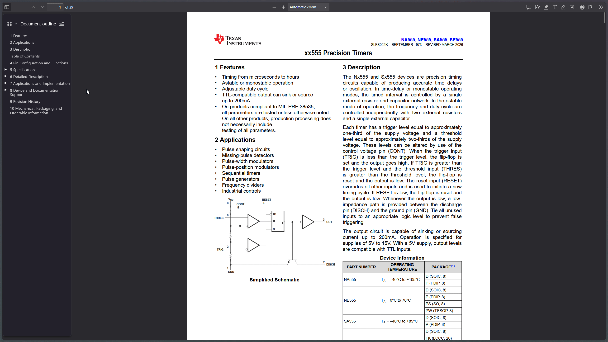
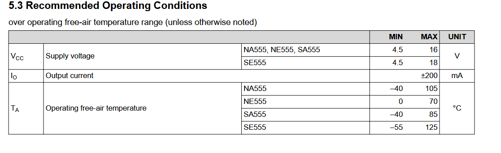
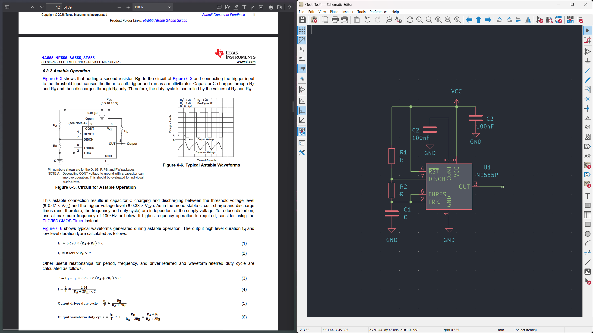
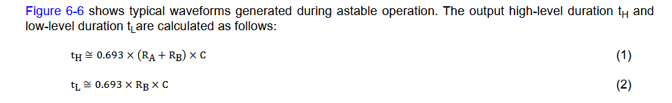
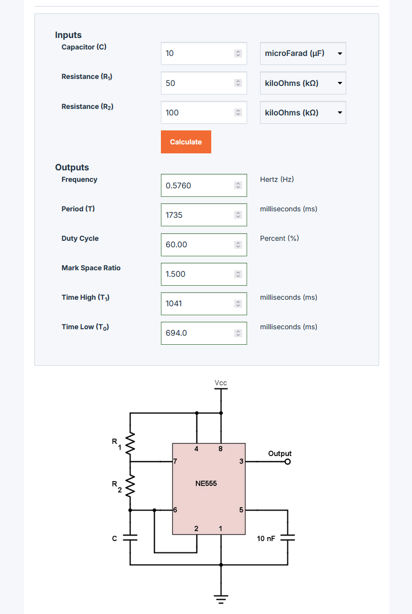
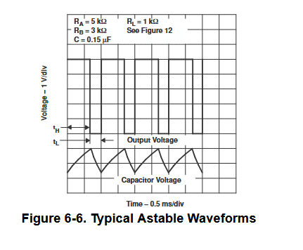
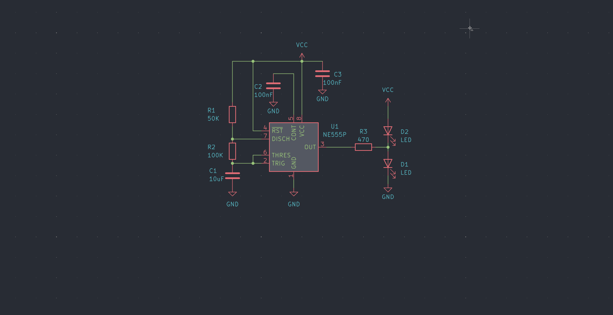
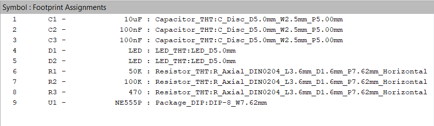
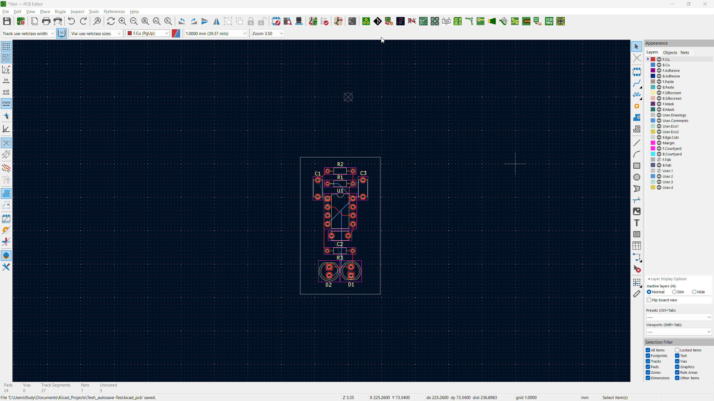
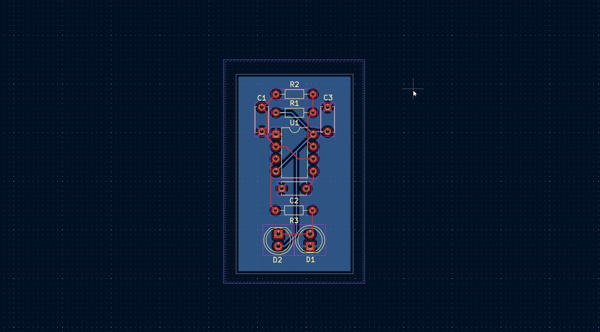

# Week 3

## Quick Review

Last week, we learned about transistors and how they are fundamental to almost every circuit in our devices. We covered BJTs, and you learned about multivibrators using them. You also explored KiCad and how to design your own PCB from scratch.

## What You'll Be Doing This Week

This week, you'll be learning about integrated circuits and how to use them in your circuits by designing your own PCB. This guide will walk you through the process and show you how a board is typically designed around an IC.

## Integrated Circuits (ICs)

You’ve probably seen those little computer chips. Those are called integrated circuits, or ICs for short. They are essentially an assembly of millions or billions of tiny, microscopic electronic components like transistors, resistors, and capacitors etched onto a silicon wafer.

They serve as the foundation of modern electronics, and nearly every device you see contains some form of IC.


### Why is it used?

ICs are helpful because they can miniaturize and simplify circuits. For example, if there is something you need often, like generating a clock signal, you could do that using a multivibrator, but it’s not very space-efficient and can be time-consuming. ICs simplify that process, and there are dedicated ICs that can generate clock signals for you.

Beyond that, ICs improve reliability since everything is manufactured as a single unit, reducing wiring errors and loose connections. They are also more power-efficient and often optimized for specific tasks, which makes designs more consistent and easier to reproduce. Using ICs also saves design time, since you can rely on pre-built, well-tested functionality instead of building everything from individual components.

### Different packages (sizes)

ICs come in many different shapes and sizes, called packages. Some common packages include DIP (Dual In-line Package), which has two rows of pins and is easy to work with, and SMD packages like SOIC (Small Outline Integrated Circuit) and QFN (Quad Flat No-leads), which are much smaller and used in compact designs.

Different packages are used depending on the application. Larger packages like DIP are easier to handle and are often used for prototyping or learning, while smaller SMD packages are used in real-world products where space is limited. Some packages are also designed for better heat dissipation or higher pin counts, depending on the complexity of the IC.


### Datasheet

If you want to use an IC, you might wonder how to get started. It is actually simple. IC manufacturers release a document called a datasheet, which includes all the important details about the IC. This includes things like pin configuration, operating voltage and current, timing characteristics, typical applications, and limits you should not exceed. It is basically the official guide for using the IC correctly and safely.

To find a datasheet, you can simply search for it online. For example, type "[IC NAME] datasheet" into Google.

#### Reading Datasheets

Let us take the [NE555 IC](https://www.ti.com/lit/ds/symlink/ne555.pdf) as an example. When you first open its datasheet, it may seem overwhelming, and you might think "What the heck is even going on? Do I need to read all 40 plus pages?" Do not worry. You do not have to read the entire document. Focus on a few key things:

- Pin functions: what each pin does and how to connect it
- Operating voltage and current: what the IC needs to function safely
- Typical application circuits: examples of how the IC can be used
- Timing characteristics or other critical specifications, depending on your project

The datasheet answers all the questions you might have and gives you enough information to design your own circuit around the IC.

##### How to read datasheets 

Here is a method I recommend for reading a datasheet:

1. Read the description section and look at the simplified schematic
2. Skim the datasheet once to get a general idea
3. Check the pin function section
4. Check the operating conditions to figure out operating voltage and current
5. Look for implementations or reference schematics

Let us go through the 555 timer datasheet as an example. Start with the description to understand what the IC does. This section summarizes the main functions and gives a general overview.

>The Nx555 and Sx555 devices are precision timing
circuits capable of producing accurate time delays
or oscillation. In time-delay or monostable operating
modes, the timed interval is controlled by a single
external resistor and capacitor network. In the astable
mode of operation, the frequency and duty cycle are
controlled independently with two external resistors
and a single external capacitor.
Each timer has a trigger level equal to approximately
one-third of the supply voltage and a threshold
level equal to approximately two-thirds of the supply
voltage. These levels can be altered by use of the
control voltage pin (CONT). When the trigger input
(TRIG) is less than the trigger level, the flip-flop is
set and the output goes high. If TRIG is greater than
the trigger level and the threshold input (THRES)
is greater than the threshold level, the flip-flop is
reset and the output is low. The reset input (RESET)
overrides all other inputs and is used to initiate a new
timing cycle. If RESET is low, the flip-flop is reset and
the output is low. Whenever the output is low, a low-
impedance path is provided between the discharge
pin (DISCH) and the ground pin (GND). Tie all unused
inputs to an appropriate logic level to prevent false
triggering
The output circuit is capable of sinking or sourcing
current up to 200mA. Operation is specified for
supplies of 5V to 15V. With a 5V supply, output levels
are compatible with TTL inputs.

This section tells us what the 555 timer can do and how it works. It can act as a timer or oscillator. In monostable mode, it produces a single timed pulse, and in astable mode, it generates a repeating waveform. The timing depends on external resistors and capacitors. The IC has defined trigger and threshold voltage levels that determine when the output changes state. The reset pin can override everything to restart the timing cycle. The output can handle a decent amount of current, up to 200mA, and it works with standard supply voltages between 5V and 15V. Essentially, this extract explains the core functions, how to control timing, and the safe operating limits for using the IC in a circuit.

Next, check the pin functions to see which pins are inputs, outputs, or control pins and what each does. The pin diagram tells you how to connect the IC in a circuit. If you do not understand a term or a function, search online for clarification. Datasheets are designed to provide all the necessary information, and a quick search can help you understand anything unfamiliar.



For the operating conditions, the Vcc supply voltage should be between 4.5 and 16 volts, and the maximum output current is 200mA. This means you should power the IC within that voltage range, or it may not work correctly, and you should not draw more than 200mA from the output, or you could damage the IC.



Looking at the feature description, you will find example schematics for different types of operation, such as monostable and astable modes. Further down, in the applications and implementation section, there are additional reference circuits showing how the IC can be used in real designs.


## Your Project

Your project for this week is to design your own PCB that uses at least one IC. I have walked you through how to read datasheets and showed you how to find information for ICs, but now it is your job to research further and use online resources to design your own board.

The ICs you can use for this week are:

- NE555
- CD4017
- LM556
- CD4060
- CD4020

It is up to you which ICs you want to use, and you can use multiple to create your own project. You might be thinking, "I do not know any of these ICs." That is why we have a little something called google.com. It is a wonderful tool that lets you search for information. Stuck somewhere? Google it. Don’t understand how a 555 timer works? Watch a video on it.

The point is that you have a vast amount of information at your disposal. Use your tools wisely and do not be afraid to try new things.

I will do a short PCB walkthrough using a 555 timer IC. You are encouraged not to follow it step by step or copy it exactly. The guide is brief on purpose, so you will need to search for solutions to any problems you encounter.

## Designing the PCB

I’m going to use the 555 astable circuit references as a starting point and create my own schematic around them. For simplicity in this tutorial, I will make a basic astable multivibrator circuit to blink two LEDs, using the reference schematic as a starting point.

Ideally, we would simulate the circuit first, but ICs are often not fully modeled in simulation software. This means we need to be extra careful to ensure the design is correct.

I will take the astable multivibrator example and bring it into KiCad.



Here the `R_L` just means the **load resistance**, and it represents whatever you connect to the output of the 555 timer IC.

In other words, it’s not a specific required resistor in the timing circuit, it’s just a placeholder for the thing being driven.

Reading the astable operation section and it gives me the formula for the period of time the signal will be high and low. I use that to calculate my R1, R2 and C1 values.



I want the signal to be high for roughly 1 second, and then go low. So I'll use an online calculator and find rough values to use.




In astable mode, the 555 timer IC outputs a continuous square wave signal. The time the signal stays high and low is determined by the values of the resistors and capacitor in the circuit, and is not necessarily evenly split. In most basic configurations, the signal stays high longer than it stays low.



Knowing this, I can make it alternate between two LEDs by connecting them so that one LED lights up when the output is high and the other lights up when the output is low. This way, the LEDs blink in turn with the timer’s output.



When the output signal goes high the bottom LED will glow, and when the output signal goes low the top LED will glow.

Next, I will assign footprints to the components and move to the PCB editor to design a simple PCB for the circuit.

Here's a table which shows you what common footprints to use:

| **Symbol** | **Footprint**                                                                                                              |
| ---------- | -------------------------------------------------------------------------------------------------------------------------- |
| Transistor | Package_TO_SOT_THT:TO-92L_Inline_Wide                                                                                      |
| Resistor   | Resistor_THT:R_Axial_DIN0204_L3.6mm_D1.6mm_P7.62mm_Horizontal                                                              |
| Capacitor  | Capacitor_THT:C_Disc_D5.0mm_W2.5mm_P5.00mm                                                                                 |
| Switch     | Button_Switch_THT:SW_PUSH_6mm                                                                                              |
| Header     | Connector_PinHeader_2.54mm:PinHeader_1x02_P2.54mm_Vertical                                                                 |
| LED        | LED_THT:LED_D5.0mm                                                                                                         |
| NE555      | Package_DIP: DIP-8_W7.62mrn                                                                                                |
| Other ICs  | Try to read the datasheets and find what footprint it uses :D be sure to use the THT version of the footprints and not SMD |



Some tips for PCB design and routing:

- Keep functional groups close together. For example, if a schematic shows a pull-up resistor connected to a pin, place the resistor near that pin rather than near the power source.
- Plan your layout around how the circuit operates to minimize long traces and reduce noise.
- Group related components to make routing easier and improve readability.
- Try to route all your signals on one layer, and then use the other for routing power.

Layout is key. Spend most of your time perfecting it to make routing easier and more efficient.

PCB design is an iterative process. Do not be afraid to scrap a layout and start over. Most PCB routing requires at least two or three revisions to move components around and optimize connections.

I'll also introduce a little something called `Filled Zones` and how to use that to create something called as a *Ground Plane*. You may notice that in your PCB you have a ton of ground nets and that gets annoying to route, fear not as you can actually just create a solid ground layer to connect everything.

To do so first select the `Draw Filled Zones` on the right toolbar and while selected click inside the PCB editor. It will open up a dialog, here you can select a layer and a net, for the layer I suggest selecting a layer where you don't have your signals routed, in my case this would be `B.Cu` and for the net I select `GND`. I then create a polygon using that tool to inscribe my board withing it. Once I close the polygon, I simply press `B` to build the zone.



Now remember every time you route something new on the layer you have your ground pour, you need to rebuild it, otherwise your trace is just shorted with the ground plane which is bad. This is also a reason why it's recommended to have your ground pour on a separate layer from all your signal traces.

To polish your PCB, you can fillet the corners of your board. Select the edge cut layer and round the corners to give the board a cleaner look.



Remember to rebuild you zones too!

Once you are satisfied, run DRC and ensure there are no errors and then simply export your PCB using the Fabrication Toolkit.

## Submitting

Now that everything is done, you can get ready to submit your project. Make sure your GitHub repository includes the following:

- A detailed `README.md`
- A `Journal.md` (if you are journaling your progress)
- Falstad source files
- KiCad source files (`.sch`, `.pcb`, `.prj`)
- Production files (Gerbers)

You also need to ensure that your repository is formatted nicely. An example structure could look like this:

```
project-root/
├─ attachments/
│  ├─ image1.png
│  ├─ image2.png
│  └─ image3.png
├─ production/
│  ├─ gerber.zip
│  ├─ bom.csv
│  ├─ designator.csv
│  ├─ position.csv
│  └─ netlist.ipc
├─ src/
│  ├─ kicad/
│  │  ├─ kicad.sch
│  │  ├─ kicad.pcb
│  │  └─ kicad.prj
│  └─ falstad/
│     └─ falstad.txt
├─ Journal.md
└─ README.md
```

In your `README.md`, make sure you include the following:

1. A title
2. What the project is and why you made it
3. A PCB render
4. A Falstad simulation and explanation of how it works
5. A schematic image
6. A PCB image

Here’s an example template you can use:

```
# Project Title

{What is this and why you made it}


---

## Simulation

{Yap about how it works}


[Link to Demo](Falstad Demo Link)

---
## Schematic


## PCB


---

Add credits here or whatever you want :D

```

### How do I Journal / What the heck even is Journaling? 

Journaling basically means writing down and documenting how you designed your project, what was going on in your head, the problems you ran into, and how you solved them.

A solid hardware design journal should document both what you built and how you thought about building it. The goal is that someone (including future you) can understand the reasoning, reproduce the project, and learn from the mistakes.

A good journal includes the following things:

- Project Goal
- Initial Idea/Research
- Detailed Design
- Testing
- Problems Encountered
- Iterations/Improvements
- Reflection

A good rule of thumb is that your journal should answer these three main questions:

1. Why did I design it this way?
2. How did I build it?
3. What happened when I tested it?

An example template for journaling a hardware project could look like this:

```
# Project Name

[Preface] I'm building X because of Y.

## Date - [Heading]

Today I worked on X.


I ran into this issue, so I researched it and found X.

### Time Spent: X Hours

## Date - [Heading]

Today I fixed the X issue by doing Y.


### Time Spent: X Hours

```

Now you might be wondering how to actually journal.

You can use basically any editor you like and write about your daily progress. I highly recommend using markdown to format your journal, since it is simple and renders nicely on GitHub.

I personally use [Obsidian](https://obsidian.md/) for journaling because it is my go to notes app and it supports markdown, but you can use whatever you prefer.

To journal, simply create a `Journal.md` file and start writing in it.


