- Intro
	- What we're making
	- Prerequisites
- Making a Case
	- Planning your enclosure
	- Importing your PCB
	- Building the enclosure body
	- Adding cutouts and mounting points
	- Checking fit and clearances
	- Rendering
- Submitting

---

# Week 8

## Intro

This week we're stepping away from designing PCBs and circuits to learn how to design a case for our boards using CAD software. For this guide I'll be using Fusion 360 as my CAD tool of choice, but feel free to use whatever you're comfortable with.

### Prerequisites

This week is all about designing a case for the PCBs from last week, so the obvious prerequisite is that you've completed Week 7 and have a devboard ready to go.


## Making a Case

### Planning

Always start with planning! As mentioned throughout the previous guides, you should never jump into designing anything blindly. Start by thinking about what kind of case you want and maybe sketch it out. This helps you work out how everything fits together, which is much better to figure out at the start than to puzzle over mid-build.

### Importing Your PCBs

Step one is exporting your PCB from KiCad and importing it into your CAD software. To do that, go to File > Export > STEP.

Before exporting, make sure all your footprints have a 3D model attached. You can check this by opening the KiCad 3D viewer. I noticed my header 3D models were missing, so I quickly assigned them.

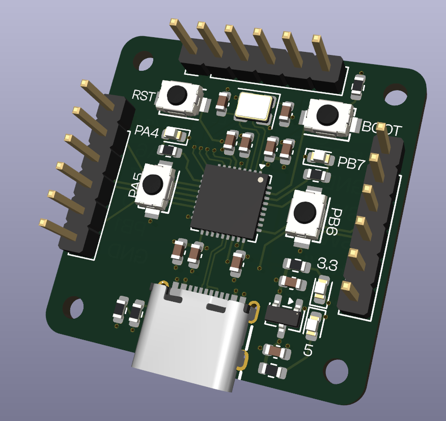

Once exported, open Fusion 360 and click Open > Open from Computer, then select the STEP file you just exported. This will load the board model into Fusion 360.

Once it's open, save it and then create a new hybrid design.

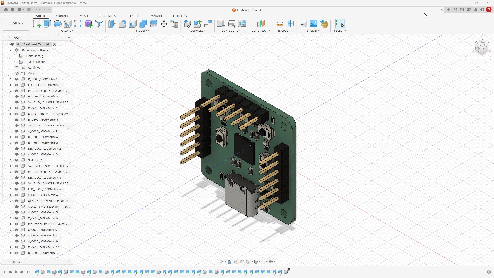

Now open the data side panel, go to Recent Data, find the board you just saved, and import it into your current design.

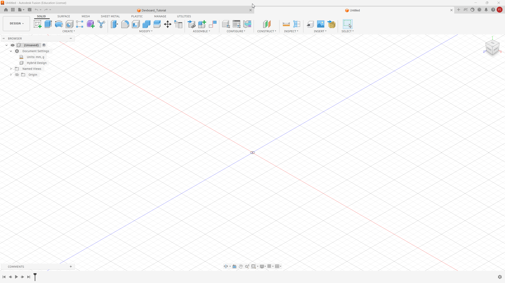

Then rotate it so it sits flat on the XY plane.

### Building The Enclosure Body

I'll start by creating a base for the bottom of the case. Normally you could just have a solid block on the bottom and mount the PCB on top, but here the header pins extend below the PCB, so a solid block won't work since the pins would collide with it. 

To do this, click Create Sketch and select the bottom face of the PCB as the plane.

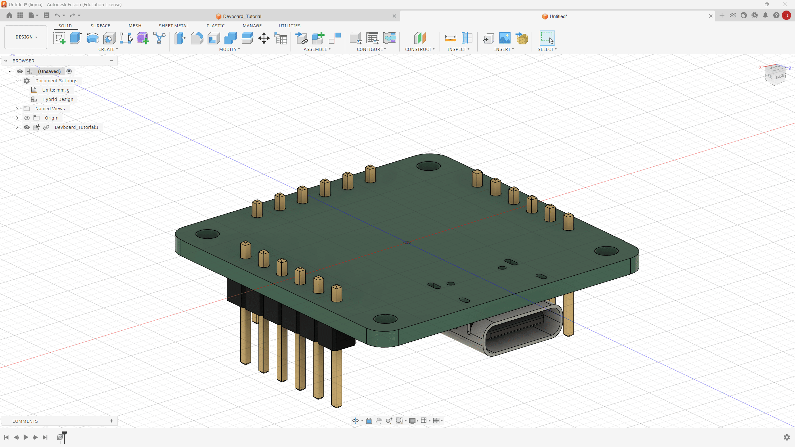

From there, sketch circles slightly larger than the screw holes and finish the sketch.

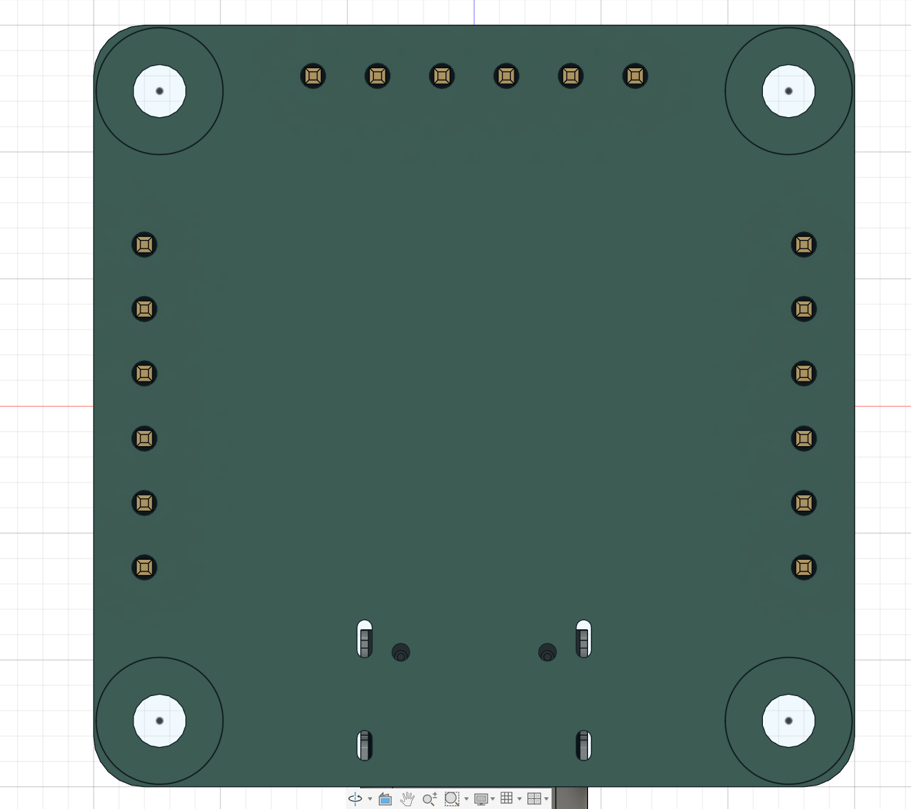

Select these 4 outer circles and extrude them by pressing `E`. Extrude up by 2mm, which is just enough to clear the bottom of the pin headers.

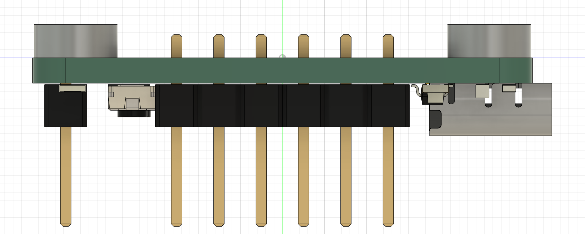

Then create another sketch on the top face of these new standoffs, and project the board geometry onto it by pressing `P` and selecting the board.


Then extrude everything up, excluding the screw holes.

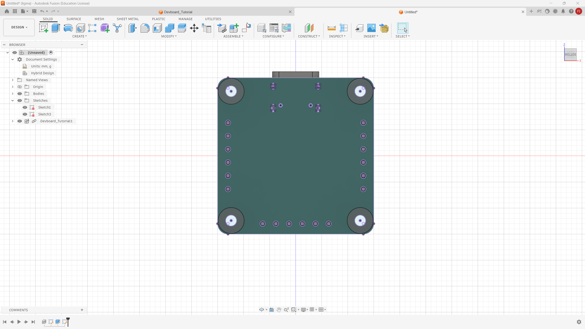

Next, design the top cover. To do that, create an offset from the bottom face and extrude it to the top, making sure to extrude it as a new body rather than joining it to the existing one.


Then close the top by creating a sketch on the top plane and extruding it up to seal it.


### Adding Mounting Holes and Cutouts

Right now all we have is a box with a PCB inside. There's no way to fasten the case shut and no way to access the USB-C port or headers.

Let's start by adding screw posts so the case can be closed securely. We need to create a sketch on the inside, but since we can't see in there right now, use the Section Analysis tool to get a view inside.


Now create the part where the screw will thread into. You have two options: either create a hole for a heat insert, or create a hole slightly smaller than your screw and thread directly into the plastic. Both are valid approaches. Heat inserts are generally more durable and can handle being screwed and unscrewed many times without wearing out. Threading directly into plastic is simpler and cheaper, but works best for cases that won't be opened and closed frequently, as the plastic threads can strip over time.

I'll thread directly into plastic, so I'll create a 1.9mm hole at the screw point and then a larger surrounding hole sized to leave enough clearance from nearby components, which in this case was 5mm.

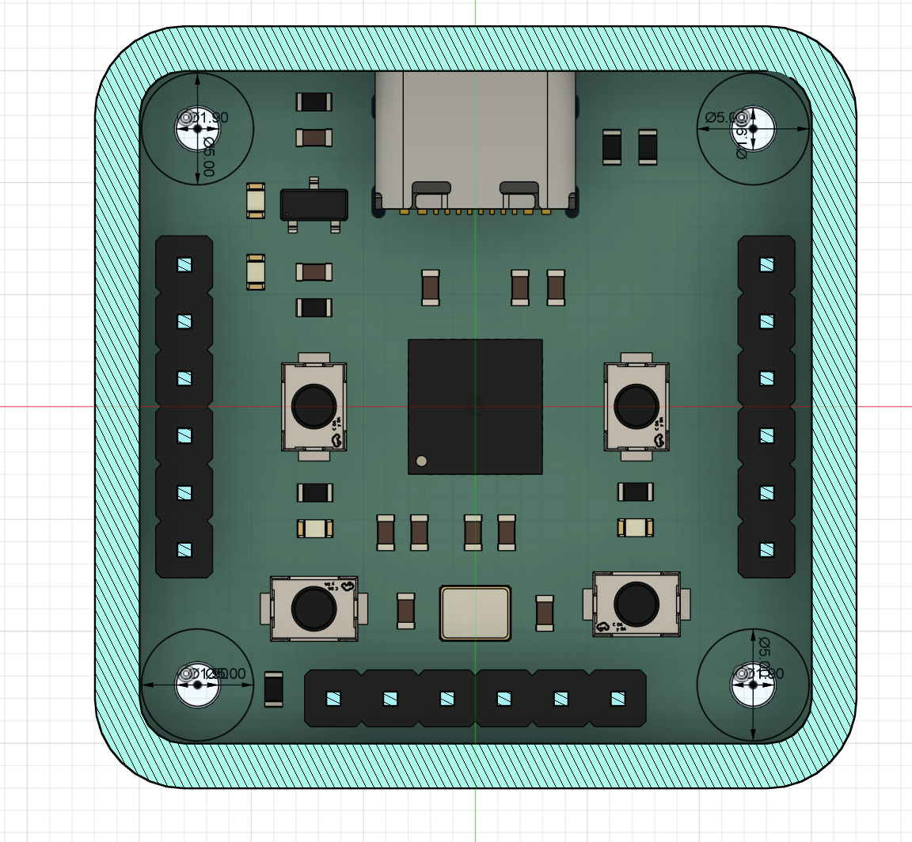

Then draw lines from the edge of the circle to the edge of the board.

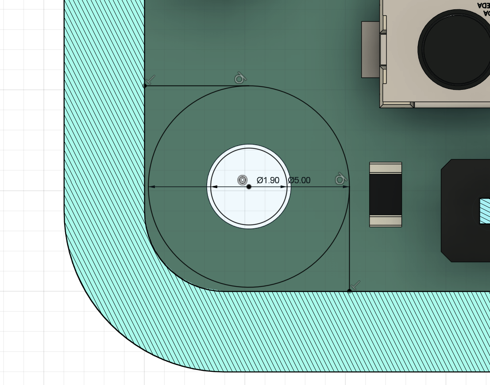


Now extrude these to the top of the case. To do so, turn off the analysis, hide the bottom body and the PCB, then extrude.


Next, add cutouts for the USB-C port and headers. You can either change the opacity of the body to see inside, or enable the section analysis again. Sketch on the face where the USB-C port is, project its geometry, add a small offset, and cut it out.


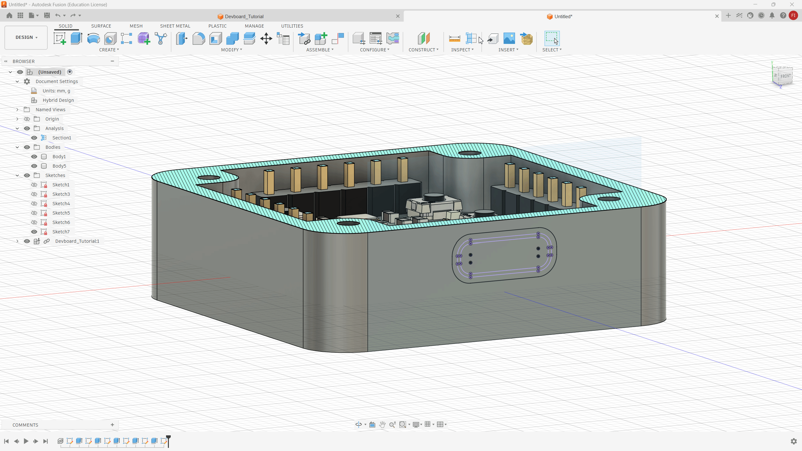

Do the same for the headers to open up access to them.

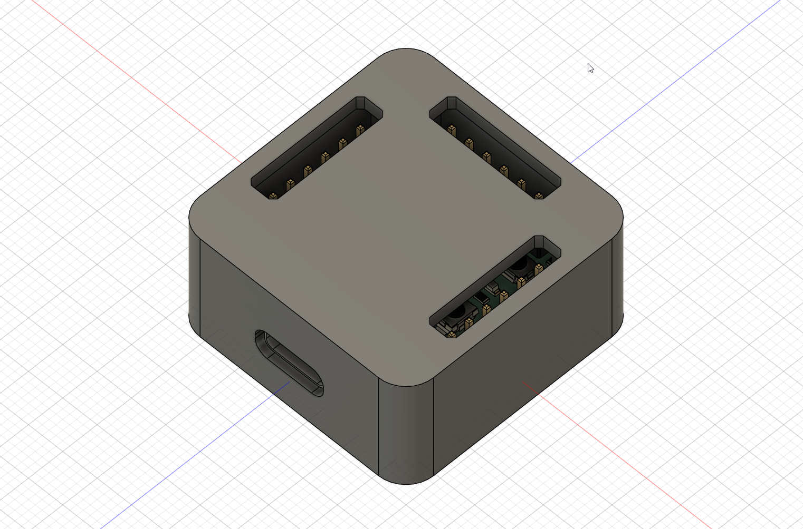

If your board has buttons or LEDs, you can also add features for those, like holes or button extenders. Here's one of my other projects as a reference for how I handled that: [https://github.com/Outdatedcandy92/Audio-Devboard](https://github.com/Outdatedcandy92/Audio-Devboard)

I won't be implementing those here though. I want you to think it through and come up with your own creative solution!

### Adjusting For Tolerances

In manufacturing, you always have to account for tolerance. The part you design on your computer will never come out perfectly identical to the design, but it'll be close. For most FDM printers, the tolerance is about ±0.2mm. So to make sure things fit properly, we need to offset the case body from the PCB by 0.2mm on each side.

That's pretty straightforward: create a sketch on the body face, offset by 0.2mm, and extrude to the PCB edge.

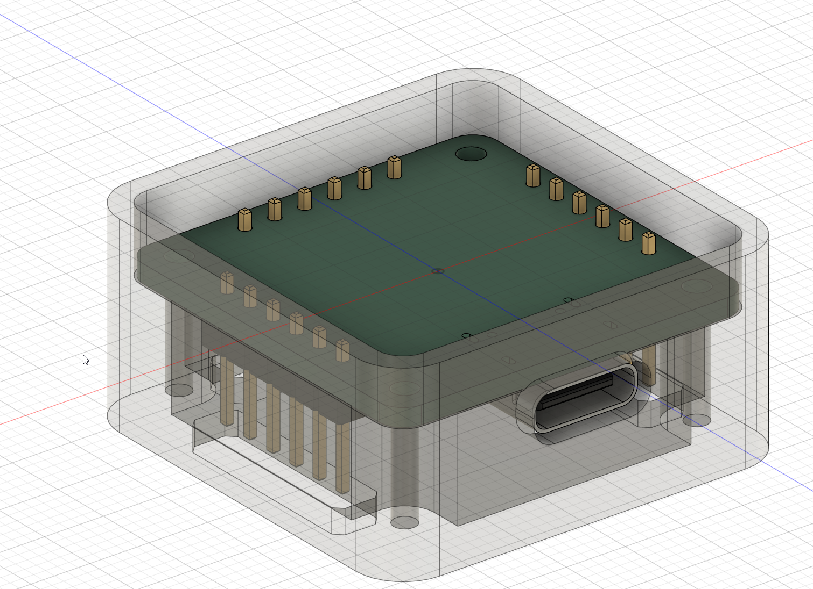

At this point the core of the case is done! Go ahead and add your own touches: patterns, designs, a keychain hole, whatever you like. Please make it something more than just a plain box :D

### Rendering

Once you're happy with your case, it's time to get a great render. Fusion has a built-in Render tab for this. You can also assign materials to color the body using the Appearance tab, which you can open by pressing `A`. Search for the material you want and drag it onto the body.

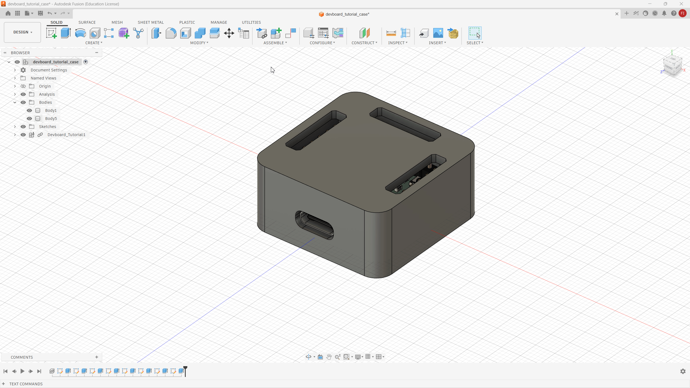


You can tweak the environment settings by clicking the Scene Settings icon at the top. From there you can adjust focal length, light intensity, environment, and more.

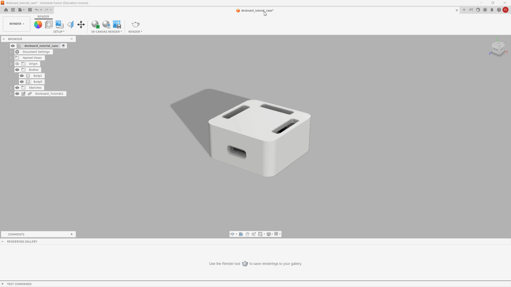

Once you're happy with the look, click the Render button, set your settings, and render away. Save the result when done.

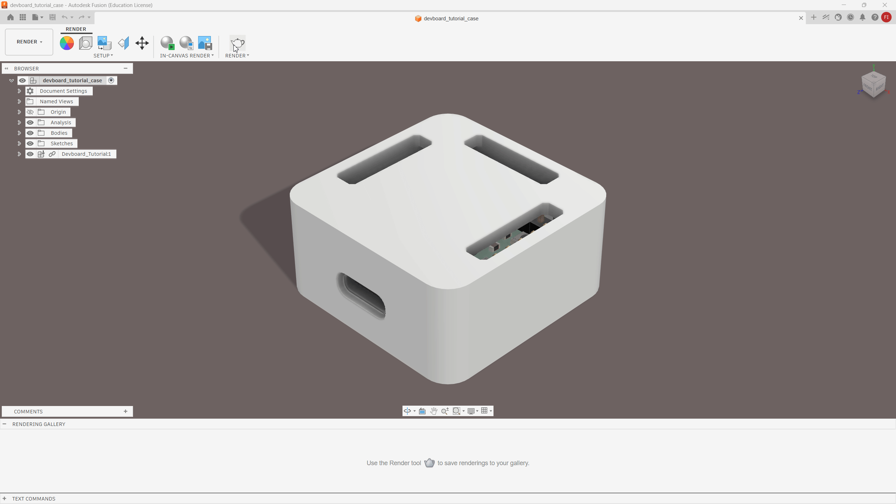

## Submitting

Since you're designing a case for an existing PCB, you'll update your existing project repository and add the new files into it.

Make sure your GitHub repository includes the following:

- STL files for each case part (right-click the body or component in the browser tree and select **Save as Mesh** -- format should be STL)
- STEP assembly (File > Export, export as STEP)
- STEP of the PCB alone (exported from KiCad)

Your repository should also be structured cleanly. Here's an example layout:
```
project-root/
├─ attachments/
│  ├─ image1.png
│  ├─ image2.png
│  └─ image3.png
├─ production/
│  ├─ gerber.zip
│  ├─ bom.csv
│  ├─ designator.csv
│  ├─ position.csv
│  ├─ netlist.ipc
│  ├─ **case_bottom.stl**
│  └─ **case_top.stl**
├─ src/
│  ├─ kicad/
│  │  ├─ kicad.sch
│  │  ├─ kicad.pcb
│  │  ├─ kicad.prj
│  │  └─ 3D.STEP
│  └─ Case.STEP
│     
├─ Journal.md
└─ README.md
```

In your `README.md`, make sure you include:

- [ ] A Title
- [ ] Project Overview
- [ ] PCB Render Image With Case
- [ ] Schematic Image
- [ ] PCB Image
- [ ] Case Image 

For your demo link please use a shareable link to view your CAD design (File->Share File Link) Example: https://a360.co/3PA5qVe

Here's an example of a minimal submission that I made: https://github.com/Outdatedcandy92/TinySTM32

Your submission for this week have to be on par if not better than the submission above. Things you can consider adding are a exploded view render, cool patterns and etc.