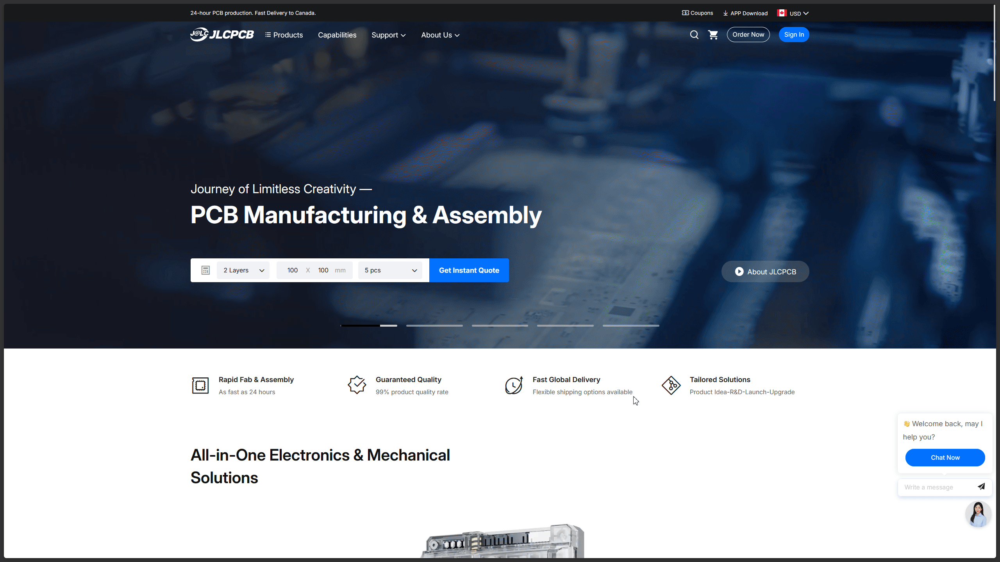
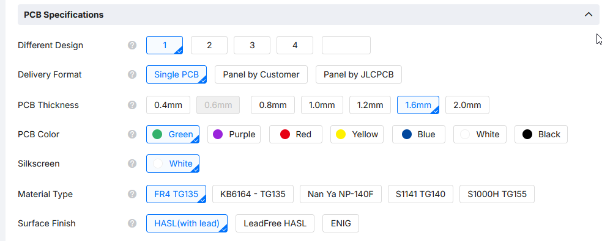
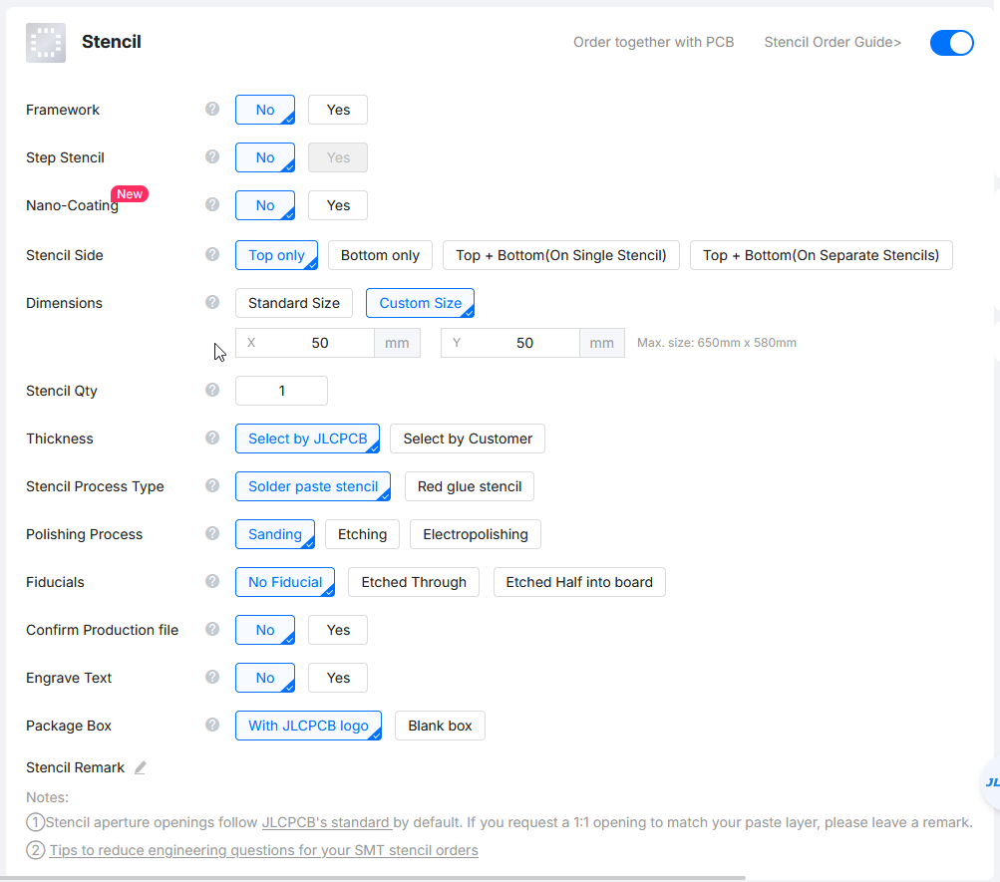

- Intro
    - What this is about
    - Before you start
- How to source parts
    - Where to buy (AliExpress / LCSC)
    - Picking the right parts
- How to order PCBs
    - Preparing your files
    - Common settings
    - Stencil
    - Shipping

---

# Week 9

## Intro

This week is about ordering your PCBs and sourcing components. Sourcing components is the step that transitions your project from a design to a build, and it's an essential skill to pick up if you're getting into hardware.

### Before You Start

You'll need to have completed the previous weeks, meaning you should have your circuits and PCBs designed, along with your BOM and Gerber files ready to go.

## How To Source Parts

Let's start with sourcing parts. I'll assume you already have a BOM ready for all your weeks. You've mainly got two options: buy from an online marketplace, or an electronics component distributor.

A good cheap marketplace is AliExpress. It has inexpensive parts and usually free shipping on most items. I'd use it for things that go around your PCB, like heat inserts, screws, OLEDs, TFTs, development boards, wires, breadboards, and so on. I'd avoid Amazon here since most items are marked up quite a bit.

For ICs and components that go on the PCB itself, like your MCU, connectors, crystals, and similar parts, go with an electronics component distributor like LCSC, DigiKey, or Mouser. LCSC is my go-to because it's the cheapest of the three and still carries quality parts.

### LCSC

To order from LCSC, you can either search and add parts to your cart manually, or if you have a BOM with LCSC part numbers (which you should if you completed Week 7), you can upload it directly.
[gif maybe]

It's really important to double check your parts and make sure they have the correct footprint, otherwise they won't fit and that's no bueno! :C

## How To Order PCBs

First up, make sure your Gerber files are ready. You'll upload these to a PCB fab to place your order. You'll need to pick a fabricator first, and you've got a few options depending on where you live. The big three are JLCPCB, PCBWay, and OSHPark.

JLCPCB and PCBWay are both Shenzhen-based fabs that offer fast, cheap, quality PCBs. JLCPCB offers $2 PCBs for 2-layer boards under 100x100mm and usually $1.50 shipping, so it's great for small orders. PCBWay is similar but slightly more expensive, though it offers more customization options like additional soldermask and silkscreen colors (even transparent PCBs, ooooh). I've used both and would recommend either. Just go with whichever is cheaper.

OSHPark is a US-based fab. I haven't used it personally, but it's a solid option if you're in the US. Depending on where you are, duties on overseas shipments can add up, so it's worth getting a quote from OSHPark to see if it works out better for you.

I'll be using JLCPCB since it's the cheapest and fastest option for me. Head over to JLCPCB.com, click Instant Quote, and upload your Gerber file.

It will automatically detect and select the layer count and dimensions. PCB quantity will stay at the minimum, which is 5.

### Common Settings

Under PCB specifications you can customize a couple of things. The two main settings are PCB color and surface finish.

PCB color is pretty self-explanatory: it's the soldermask color. The default is green, which also has the fastest manufacturing time. Other colors are usually the same price but may add a day or two to the turnaround.

Surface finish is the finish applied to the pads on your PCB. The default is HASL, which gives a silver finish. It contains lead by default, but it's not particularly dangerous unless you're literally eating it (and at that point, the fiberglass is probably more of a concern). You can also opt for lead-free HASL, though it will look a bit duller. ENIG is the gold finish option, but the process is more involved and gold is expensive, so costs go up. Stick with HASL for prototypes unless you specifically need ENIG.

### Stencils

If your PCB has fine-pitch SMD components (SMD, not THT!), you'll probably want to add a stencil to your order. It's simple to do: just scroll down and toggle the stencil option.

One important thing: set your stencil to a custom size. Do not leave it at the default size, as it will be massive, difficult to handle, and expensive to ship.

For the custom size, go a bit bigger than your PCB. Stencils under 100x100mm are $3 flat, so that's a good target size. If your PCB is tiny, like 20x20mm, something like 30x30mm or 50x50mm works fine. You get the idea.

PCB fabs also offer PCBA (PCB Assembly) where they solder the components for you. We're skipping that for these weeks though, since a) it's expensive and b) you can hand solder these yourself!
## Shipping

Always go with the cheapest available option. On AliExpress, shipping is free on most items, so filter for that. On JLCPCB or LCSC, there's no free shipping, but they offer options like Global Standard Direct Line, which is usually the cheapest. The goal is the same either way: optimize for cost.

One thing to watch out for: avoid options like "My UPS/DHL/FedEx Account." These aren't full shipping options. They pass your info to the carrier and you still end up paying for shipping on top of that.

---

You're all set to start sourcing your stuff!

Here's a quick checklist of what to order:

- [ ]  PCBs (and a stencil if needed)
- [ ]  ICs (whatever your design calls for)
- [ ]  Passives (resistor and capacitor kits)
- [ ]  Wires (Dupont or regular)

And here's the order I'd suggest budgeting in:

1. PCBs first
2. Parts for the PCBs
3. Passive kits, wires, breadboards
4. Tools like wire cutters or a hotplate/soldering iron (if you have budget left over)
